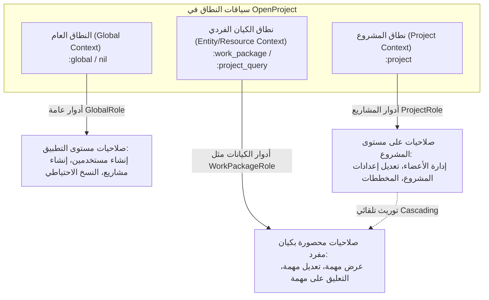

# بحث توثيقي شامل: سياقات النطاق في نظام صلاحيات OpenProject
>
> **المصدر**: المصادر الرسمية لنواة OpenProject (وثائق التطوير الرسمية ومستودع الشيفرة البرمجية `opf/openproject`).  
> **الإصدار المستهدف**: OpenProject 14.0+ (بما في ذلك التحديث الجذري لهندسة الصلاحيات المبني عبر تذكرة التطوير الرسمية `#51212`).  
> **تاريخ الإعداد**: أكتوبر 2026  
> **الحالة**: بحث توثيقي تخصصي مستقل ومفصل.

---

## الفهرس العام

1. [المقدمة والمفهوم الجوهري لسياقات النطاق (Scope Contexts)](#1-المقدمة-والمفهوم-الجوهري-لسياقات-النطاق)
2. [التصنيف الرسمي لسياقات النطاق في OpenProject](#2-التصنيف-الرسمي-لسياقات-النطاق-في-openproject)
   - [2.1 النطاق العام (Global Context - `:global`)](#21-النطاق-العام-global-context---global)
   - [2.2 نطاق المشروع (Project Context - `:project`)](#22-نطاق-المشروع-project-context---project)
   - [2.3 نطاق الكيانات الفردية (Resource / Entity Context - `:work_package` و `:project_query`)](#23-نطاق-الكيانات-الفردية-resource--entity-context)
3. [تعريف سياق النطاق برمجياً عبر محرك الوصول (`permissible_on`)](#3-تعريف-سياق-النطاق-برمجياً-عبر-محرك-الوصول-permissible_on)
   - [3.1 بنية تعريف الصلاحية في `OpenProject::AccessControl`](#31-بنية-تعريف-الصلاحية-في-openprojectaccesscontrol)
   - [3.2 الصلاحيات متعددة السياقات (Multi-Context Permissions)](#32-الصلاحيات-متعددة-السياقات-multi-context-permissions)
   - [3.3 آليات الحماية ومنع أخطاء السياق (`IllegalPermissionContextError`)](#33-آليات-الحماية-ومنع-أخطاء-السياق-illegalpermissioncontexterror)
4. [قواعد التوريث وتداخل النطاقات (Cascading & Inheritance Logic)](#4-قواعد-التوريث-وتداخل-النطاقات-cascading--inheritance-logic)
   - [4.1 الكيانات المرتبطة بمشروع مقابل الكيانات المستقلة](#41-الكيانات-المرتبطة-بمشروع-مقابل-الكيانات-المستقلة)
   - [4.2 خوارزمية الفحص المركب في `UserPermissibleService`](#42-خوارزمية-الفحص-المركب-في-userpermissibleservice)
   - [4.3 ارتباط سياق المشروع بحالة النشاط وتفعيل الوحدات (`Project Modules`)](#43-ارتباط-سياق-المشروع-بحالة-النشاط-وتفعيل-الوحدات-project-modules)
5. [واجهات البرمجة الحديثة لفحص الصلاحيات بحسب السياق](#5-واجهات-البرمجة-الحديثة-لفحص-الصلاحيات-بحسب-السياق)
   - [5.1 دوال كائن المستخدم المباشرة (`Users::PermissionChecks`)](#51-دوال-كائن-المستخدم-المباشرة-userspermissionchecks)
   - [5.2 التوجيه الذكي للسياقات الديناميكية (`allowed_based_on_permission_context?`)](#52-التوجيه-الذكي-للسياقات-الديناميكية)
6. [استعلامات النطاق على مستوى قاعدة البيانات (Database Scopes & Isolation)](#6-استعلامات-النطاق-على-مستوى-قاعدة-البيانات-database-scopes--isolation)
7. [انعكاس سياقات النطاق على الواجهة الأمامية وواجهات HAL+JSON](#7-انعكاس-سياقات-النطاق-على-الواجهة-الأمامية-وواجهات-haljson)
8. [دليل الترقية والتحول التاريخي (من `allowed_to?` إلى السياقات المحددة)](#8-دليل-الترقية-والتحول-التاريخي-من-allowed_to-إلى-السياقات-المحددة)
9. [أفضل الممارسات وكتابة الاختبارات البرمجية (Testing Scopes)](#9-أفضل-الممارسات-وكتابة-الاختبارات-البرمجية-testing-scopes)
10. [المصادر والمراجع الرسمية](#10-المصادر-والمراجع-الرسمية)

---

## 1. المقدمة والمفهوم الجوهري لسياقات النطاق

في الإصدارات الكلاسيكية لمنصة OpenProject (المشتقة تاريخياً من Redmine ثم ChiliProject)، كان التحقق من الصلاحيات يعتمد على دالة ثنائية واحدة: `User#allowed_to?(action, project)`. كان هذا التصميم يعاني من قصور جوهري يُعرف بـ **غموض النطاق (Scope Ambiguity)**؛ حيث كان فحص الصلاحيات العامة وصلاحيات المشاريع يختلط معاً، وكان استدعاء دالة دون تمرير مشروع قد يعني البحث عما إذا كان المستخدم يملك الصلاحية في "أي مشروع عشوائي"، مما أدى إلى ثغرات محتملة وسلوكيات غير متوقعة.

ابتداءً من الإصدار **13.1** وصولاً إلى الحذف النهائي في الإصدار **14.0** (وفق بطاقة العمل الهندسية الرسمية رقم **#51212**)، أعادت المنصة بناء منظومة الصلاحيات بالكامل لتعتمد على مفهوم صارم هو **سياقات النطاق (Permission Scope Contexts)**.

### ما هو "سياق النطاق" (Scope Context)؟

سياق النطاق هو **المحدد البيئي أو الكياني الذي تصح الصلاحية في إطاره حصراً**. في البنية الحديثة لـ OpenProject:

1. **لا توجد صلاحية عائمة أو بلا سياق**: لكل صلاحية سياقات مقبولة محددة مسبقاً (`permissible_on`).
2. **الفصل الصارم في التحقق**: فحص الصلاحية في غير سياقها الصحيح يعد خطأ برمجياً فادحاً يوقفه النظام فوراً (`IllegalPermissionContextError`).
3. **التدرج الهرمي**: تتدرج سياقات النطاق من مستوى النظام ككل، نزولاً إلى مستوى المشروع، وصولاً إلى مستوى السجل أو المورد الفردي (Resource/Entity Level).



---

## 2. التصنيف الرسمي لسياقات النطاق في OpenProject

تحدد الشفرة المصدرية في `lib/open_project/access_control/permission.rb` و `app/models/member.rb` الفئات الرسمية المعتمدة لسياقات النطاق:

### 2.1 النطاق العام (Global Context - `:global`)

- **الكيان المرجعي**: تطبيق OpenProject ككل (يُمرر كـ `nil` أو الرمز `:global`).
- **نوع الدور المرتبط**: `GlobalRole` (المُسند للمستخدمين دون ربطهم بأي مشروع).
- **الهدف الوظيفي**: إدارة وظائف المنصة التشغيلية والإدارية التي لا تنتمي جغرافياً أو تنظيمياً لمشروع واحد.
- **أمثلة على الصلاحيات العامة الرسمية**:
  - `:add_project`: إنشاء مشاريع جديدة.
  - `:create_user` و `:edit_users`: إدارة حسابات المستخدمين.
  - `:create_backup`: إنشاء واستعادة النسخ الاحتياطية للنظام.
  - `:view_all_users_and_groups`: استعراض كافة المستخدمين والمجموعات متجاوزاً قيود المشاريع.
  - `:manage_public_project_lists`: إدارة ونشر قوائم المشاريع المشتركة.
- **طريقة التحقق البرمجي**:

  ```ruby
  user.allowed_globally?(:add_project)
  ```

---

### 2.2 نطاق المشروع (Project Context - `:project`)

- **الكيان المرجعي**: كائن من فئة `Project` (أو الرمز `:project`).
- **نوع الدور المرتبط**: `ProjectRole` (ويشمل أيضاً الأدوار المدمجة: `NonMember` و `Anonymous`).
- **الهدف الوظيفي**: التحكم في الموارد والعمليات التي تقع بالكامل داخل نطاق مشروع محدد.
- **شروط العمل داخل سياق المشروع**:
  1. **نشاط المشروع (`Project Active State`)**: لا تُمنح أي صلاحية سياقية في مشروع مؤرشف؛ يجب أن يكون المشروع نشطاً (`project.active?`) أو في طور الأرشفة المؤقتة (`being_archived?`).
  2. **تفعيل وحدة المشروع (`Module Activation`)**: الصلاحية التابعة لوحدة معينة (مثل `:wiki` أو `:costs` أو `:budgets`) لا تسري داخل سياق المشروع إلا إذا كانت تلك الوحدة مفعّلة في إعدادات ذلك المشروع تحديداً.
- **طريقة التحقق البرمجي**:

  ```ruby
  # التحقق داخل مشروع محدد
  user.allowed_in_project?(:view_work_packages, project)

  # التحقق مما إذا كان المستخدم يملك الصلاحية في أي مشروع من المشاريع
  user.allowed_in_any_project?(:view_work_packages)
  ```

---

### 2.3 نطاق الكيانات الفردية (Resource / Entity Context)

يمثل هذا النطاق أحدث تطور في بنية OpenProject المعمارية، حيث تم تحويل نموذج العضوية `Member` ليكون متعدد الأشكال (`Polymorphic Member Association`) عبر حقل `entity_type` و `entity_id`.

يحدد النموذج `app/models/member.rb` الكيانات المعترف بها رسمياً في النواة:

```ruby
ALLOWED_ENTITIES = [
  "WorkPackage",
  "ProjectQuery"
].freeze
```

#### أ. سياق حزم العمل (`:work_package`)

- **الكيان المرجعي**: كائن من فئة `WorkPackage` (مهمة، ميزة، خطأ برمجي، مرحلة رئيسية).
- **نوع الدور المرتبط**: `WorkPackageRole`.
- **حالات الاستخدام الحقيقية**: ميزة **مشاركة حزم العمل (`Work Package Sharing`)**. يمكن مشاركة مهمة بعينها مع مستخدم ليس عضواً في المشروع إطلاقاً، وتحديد صلاحياته على تلك المهمة حصراً (عرض، تحرير، تعليق).
- **طريقة التحقق البرمجي**:

  ```ruby
  # فحص الصلاحية على مهمة محددة
  user.allowed_in_work_package?(:edit_work_packages, work_package)

  # فحص الصلاحية على أي مهمة داخل النظام
  user.allowed_in_any_work_package?(:view_work_packages)

  # فحص الصلاحية على أي مهمة تابعة لمشروع معين
  user.allowed_in_any_work_package?(:view_work_packages, in_project: project)
  ```

#### ب. سياق استعلامات المشاريع (`:project_query`)

- **الكيان المرجعي**: كائن من فئة `ProjectQuery`.
- **الهدف الوظيفي**: إدارة أذونات رؤية وتعديل استعلامات وجداول المشاريع المحفوظة ومشاركتها بين الفرق دون الحاجة لمنح أدوار إدارية عامة.
- **طريقة التحقق البرمجي**:

  ```ruby
  user.allowed_in_project_query?(:manage_project_queries, project_query)
  ```

---

## 3. تعريف سياق النطاق برمجياً عبر محرك الوصول (`permissible_on`)

تُدار شجرة الصلاحيات في OpenProject عبر فئة البناء `OpenProject::AccessControl::Mapper` ونموذج `OpenProject::AccessControl::Permission`.

### 3.1 بنية تعريف الصلاحية في `OpenProject::AccessControl`

عند تسجيل أي صلاحية في ملفات التهيئة (`config/initializers/permissions.rb` أو محركات الإضافات `engine.rb`)، **يعد وسيط `permissible_on:` إلزامياً**:

```ruby
OpenProject::AccessControl.map do |map|
  # 1. صلاحية عامة حصراً:
  map.permission :create_user,
                 { users: %i[new create] },
                 permissible_on: :global,
                 grant_to_admin: true

  # 2. صلاحية خاصة بالمشروع حصراً:
  map.project_module :repository do |pmap|
    pmap.permission :browse_repository,
                    { repositories: %i[show entry raw annotate] },
                    permissible_on: :project
  end

  # 3. صلاحية متعددة السياقات (المشروع + حزم العمل):
  map.project_module :work_package_tracking do |pmap|
    pmap.permission :view_work_packages,
                    { work_packages: %i[index show] },
                    permissible_on: %i[project work_package]

    pmap.permission :edit_work_packages,
                    { work_packages: %i[edit update] },
                    permissible_on: %i[project work_package]
  end
end
```

### 3.2 فك سياق الكائن برمجياً (`permissible_on?`)

داخل كلاس `OpenProject::AccessControl::Permission`، يتم التعرف التلقائي على نوع السياق الممرر:

```ruby
def permissible_on?(context_type)
  # تفريغ الكائنات المغلفة أو المندوبة (Decorated / Delegated Objects)
  context_type = context_type.__getobj__ if context_type.class.ancestors.include?(SimpleDelegator)

  context_symbol = case context_type
                   when WorkPackage
                     :work_package
                   when Project
                     :project
                   when ::ProjectQuery
                     :project_query
                   when Symbol
                     context_type
                   when nil
                     :global
                   else
                     raise "Unknown context: #{context_type}"
                   end

  @permissible_on.include?(context_symbol)
end
```

### 3.3 آليات الحماية ومنع أخطاء السياق (`IllegalPermissionContextError`)

إحدى أعظم مزايا هندسة سياقات النطاق في OpenProject هي **اكتشاف الأخطاء البرمجية أثناء التشغيل والتطوير (Fail-Fast Architecture)**.

إذا حاول مطور فحص صلاحية عامة في سياق مشروع (أو العكس)، فلن تقوم المنصة بإرجاع `false` بصمت كما كان يحدث في الأنظمة القديمة، بل تُطلق استثناءً صريحاً يوضح الخطأ:

```ruby
# محاولة فحص صلاحية عامة داخل مشروع:
user.allowed_in_project?(:create_user, project)

# الاستجابة الناتجة من النواة:
# => Authorization::IllegalPermissionContextError: 
#    Used permission "create_user" which maps to create_user in project context. 
#    Correct contexts for this permission are: global.
```

وبالمثل، إذا استعلم المطور عن اسم صلاحية غير معرف إطلاقاً (أو احتوى الاسم على خطأ إملائي)، يطلق النظام:

```ruby
# => Authorization::UnknownPermissionError: 
#    Used permission "create_users" that is not defined. It will never return true.
```

---

## 4. قواعد التوريث وتداخل النطاقات (Cascading & Inheritance Logic)

تطبق خدمة التحقق من الأذونات `Authorization::UserPermissibleService` خوارزمية ذكية لمعالجة **تداخل النطاقات والتوريث الهرمي**.

### 4.1 الكيانات المرتبطة بمشروع مقابل الكيانات المستقلة

يفرّق النظام برمجياً بين نوعين من الكيانات:

1. **كيان تابع لمشروع (`Project-Scoped Entity`)**: كيان يمتلك علاقة ارتباط بمشروع (`entity_class.reflect_on_association(:project).present?`)، مثل `WorkPackage`.
2. **كيان مستقل بذاته (`Standalone Entity`)**: كيان غير مرتبط بمشروع مباشرة.

### 4.2 خوارزمية الفحص المركب في `UserPermissibleService`

عند فحص صلاحية على كيان فردي مرتبط بمشروع (مثل مهمة `WorkPackage`)، تنفذ الدالة المنطق الآتي:

$$\text{Authorized} = \text{AllowedInProject}(\text{Permission}, \text{Entity.Project}) \lor \text{DirectEntityPermission}(\text{Entity})$$

شفرة النواة الفعلية من `app/services/authorization/user_permissible_service.rb`:

```ruby
def allowed_in_single_project_scoped_entity?(permissions, entity)
  return false if entity.nil? || entity.project.nil?
  return false unless entity.project.active? || entity.project.being_archived?

  permissions_filtered_for_project = permissions_by_enabled_project_modules(entity.project, permissions)
  return false if permissions_filtered_for_project.empty?

  # التحقق المزدوج: إما أن يملك الصلاحية عبر عضويته في المشروع، 
  # أو يملك دوراً مباشراً مسنداً على حزمة العمل بعينها (Work Package Sharing)
  allowed_in_single_project?(permissions, entity.project) ||
    cached_permissions(entity).intersect?(permissions_filtered_for_project)
end
```

#### جدول قواعد التوريث بين النطاقات

| السيناريو | هل يملك دوراً في المشروع؟ | هل يملك دوراً على المهمة؟ | النتيجة النهائية | التعليل الهندسي |
| :--- | :---: | :---: | :---: | :--- |
| **عضو مشروع كامل** | نعم (محرر) | لا يوجد | **مسموح** | توريث تلقائي من سياق المشروع إلى سياق المورد. |
| **مستخدم خارجي (Shared WP)** | لا (غير عضو) | نعم (عرض) | **مسموح** (بالعرض فقط) | الصلاحية ممنوحة في سياق الكيان الفردي مباشرة. |
| **مشروع مؤرشف** | نعم (مدير) | نعم | **مرفوض** | أرشفة المشروع تلغي السياق التشغيلي لكافة موارده. |
| **وحدة المهام معطلة بالمشروع** | نعم (مدير) | نعم | **مرفوض** | تعطيل وحدة `work_package_tracking` يلغي الصلاحيات السياقية التابعة لها. |

---

## 5. واجهات البرمجة الحديثة لفحص الصلاحيات بحسب السياق

### 5.1 دوال كائن المستخدم المباشرة (`Users::PermissionChecks`)

يتم توليد دوال فحص الصلاحيات تلقائياً في كائن `User` لكل كيان مسجل في `Member::ALLOWED_ENTITIES`:

```ruby
# توليد دوال الكيانات تلقائياً في Nواة OpenProject
Member::ALLOWED_ENTITIES.each do |entity_model_name|
  entity_class = entity_model_name.constantize
  entity_name_underscored = entity_class.model_name.element

  define_method :"allowed_in_#{entity_name_underscored}?" do |permission, entity|
    allowed_in_entity?(permission, entity, entity_class)
  end

  define_method :"allowed_in_any_#{entity_name_underscored}?" do |permission, in_project: nil|
    allowed_in_any_entity?(permission, entity_class, in_project:)
  end
end
```

ينتج عن ذلك واجهة برمجية فائقة الوضوح والدقة:

- `user.allowed_globally?(permission)`
- `user.allowed_in_project?(permission, project)`
- `user.allowed_in_any_project?(permission)`
- `user.allowed_in_work_package?(permission, work_package)`
- `user.allowed_in_any_work_package?(permission, in_project: nil)`
- `user.allowed_in_project_query?(permission, project_query)`

---

### 5.2 التوجيه الذكي للسياقات الديناميكية

في بعض أجزاء التطبيق العامة (مثل أشرطة القوائم، أو وحدات التحكم متعددة الاستخدامات، أو خدمات التوجيه)، لا يعلم المطور سلفاً نوع السياق المتاح.

لهذا الغرض، وفّرت OpenProject موجّهاً ذكياً هو:
`user.allowed_based_on_permission_context?(permission, project: nil, entity: nil)`

تقوم هذه الدالة بفحص طبيعة الصلاحية وما يقابلها من مدخلات:

1. إذا كانت الصلاحية ذات نطاق عام (`perm.global?`) $\rightarrow$ تستدعي `allowed_globally?`.
2. إذا كانت على حزمة عمل والكيان ممرر كـ `WorkPackage` $\rightarrow$ تستدعي `allowed_in_work_package?`.
3. إذا كانت على حزمة عمل والكيان لم يُحفظ بعد في قاعدة البيانات (`new_record?`) $\rightarrow$ تفحص `allowed_in_any_work_package?(perm, in_project: entity.project)`.
4. إذا كانت على مستوى المشروع والمشروع ممرر $\rightarrow$ تستدعي `allowed_in_project?`.
5. إذا كانت على مستوى المشروع ولم يُمرر مشروع $\rightarrow$ تفحص `allowed_in_any_project?`.

---

## 6. استعلامات النطاق على مستوى قاعدة البيانات (Database Scopes & Isolation)

لا تعتمد OpenProject على جلب السجلات للذاكرة ثم فحص أذوناتها السياقية؛ بل تعكس سياق النطاق مباشرة داخل استعلامات SQL عبر `ActiveRecord Scopes`:

```ruby
# 1. جلب كافة المشاريع التي يملك فيها المستخدم صلاحية معينة
projects = Project.allowed_to(User.current, :view_work_packages)

# 2. جلب حزم العمل المصرح بها للمستخدم (تدمج أذونات المشروع ومشاركات المهام في استعلام SQL واحد)
work_packages = WorkPackage.allowed_to(User.current, :view_work_packages)

# 3. النطاق العام الموحد للرؤية على الكيانات
visible_items = WorkPackage.visible(User.current)

# 4. جلب المستخدمين المصرح لهم داخل سياق مشروع محدد
authorized_users = Authorization.users(:edit_work_packages, project)

# 5. استرجاع الأدوار حسب السياق الممرر ديناميكياً
roles = Authorization.roles(user, context)
# - إذا كان context مشروعاً -> تستدعي Authorization::UserProjectRolesQuery
# - إذا كان context كياناً فردياً -> تستدعي Authorization::UserEntityRolesQuery
# - إذا كان context فارغاً (nil) -> تستدعي Authorization::UserGlobalRolesQuery
```

---

## 7. انعكاس سياقات النطاق على الواجهة الأمامية وواجهات HAL+JSON

تعتمد الواجهة الأمامية في OpenProject (المبنية بإطار العمل Angular) على مخرجات واجهة برمجة التطبيقات API v3 بصيغة **HAL+JSON** (Hypertext Application Language):

### 1. مبدأ "حضور الرابط يحدد الصلاحية" (Link Presence as Authorization)

لا تتولى الواجهة الأمامية أي حسابات معقدة للأدوار أو الوحدات المفعّلة أو سياقات النطاق؛ بل تتكفل الواجهة الخلفية بتمثيل الأذونات السياقية عبر روابط العمليات المتاحة في حقل `_links`:

```json
{
  "_type": "WorkPackage",
  "id": 1420,
  "subject": "تطوير واجهة التوثيق",
  "_links": {
    "self": { "href": "/api/v3/work_packages/1420" },
    "update": { "href": "/api/v3/work_packages/1420/form", "method": "post" },
    "delete": { "href": "/api/v3/work_packages/1420", "method": "delete" }
  }
}
```

### 2. خدمة `ModelAuthService` في Angular

تقوم خدمة `ModelAuthService` بفحص وجود روابط الإجراءات للكيان:

```typescript
// فحص ما إذا كانت حزمة العمل المحددة قابلة للتعديل
if (this.modelAuthService.can('work_packages', 'update')) {
  this.enableInlineEdit();
}
```

### 3. مبدأ الإخفاء الأمني (404 بدلاً من 403)

عند طلب مورد فردي خارج السياق المصرح للمستخدم، لا يُرجع خادم OpenProject رمز `403 Forbidden` (الذي قد يفضح وجود الكيان)، بل يرمي استثناء `ActiveRecord::RecordNotFound` الذي يُترجم مباشرة إلى `404 Not Found`.

---

## 8. دليل الترقية والتحول التاريخي (من `allowed_to?` إلى السياقات المحددة)

يوضح الجدول التالي التطور التاريخي والبدائل المعتمدة بعد إزالة الدوال القديمة في الإصدار **14.0.0**:

| الدالة القديمة (أُزيلت في OP 14.0) | الدالة السياقية البديلة المعتمدة | نوع سياق النطاق (Scope Context) | سبب التغيير |
| :--- | :--- | :--- | :--- |
| `user.allowed_to?(perm, project)` | `user.allowed_in_project?(perm, project)` | `:project` | حظر التحقق الغامض وضمان وجود كائن مشروع صريح. |
| `user.allowed_to?(perm, nil)` | `user.allowed_in_any_project?(perm)` | `:project` (عبر المشاريع) | منع الخلط بين "أي مشروع" وبين "النطاق العام". |
| `user.allowed_to_globally?(perm)` | `user.allowed_globally?(perm)` | `:global` | وضوح الاسم والتحقق الصارم من معامل `permissible_on: :global`. |
| *غير مدعوم سابقاً* | `user.allowed_in_work_package?(perm, wp)` | `:work_package` | دعم مشاركة المهام الفردية (Work Package Sharing). |
| *غير مدعوم سابقاً* | `user.allowed_in_any_work_package?(perm)` | `:work_package` | البحث في كافة حزم العمل المصرح بها للمستخدم. |

---

## 9. أفضل الممارسات وكتابة الاختبارات البرمجية (Testing Scopes)

عند كتابة اختبارات برمجية (Specs / Unit Tests) لخصائص تتعلق بالأذونات في OpenProject، يُوصى باتباع النمط الحديث باستخدام مصانع البيانات (`FactoryBot`):

```ruby
# إعداد دور عام وتعيينه للمستخدم
let(:global_role) { create(:global_role, permissions: [:add_project]) }
let(:global_user) { create(:user, global_roles: [global_role]) }

# إعداد دور مشروع وتعيين عضوية
let(:project_role) { create(:project_role, permissions: [:view_work_packages, :edit_work_packages]) }
let(:project) { create(:project) }
let(:project_user) do
  create(:user, member_with_roles: { project => [project_role] })
end

# إعداد دور كيان مفرد لمهمة بعينها (Work Package Sharing)
let(:wp_role) { create(:view_work_package_role) }
let(:work_package) { create(:work_package, project:) }
let(:shared_user) do
  user = create(:user)
  create(:member,
         principal: user,
         project:,
         entity: work_package,
         roles: [wp_role])
  user
end

# اختبار الفحوصات السياقية
it "respects scope contexts accurately" do
  expect(global_user.allowed_globally?(:add_project)).to be true
  expect(project_user.allowed_in_project?(:edit_work_packages, project)).to be true
  expect(shared_user.allowed_in_work_package?(:view_work_packages, work_package)).to be true
  expect(shared_user.allowed_in_project?(:view_work_packages, project)).to be false
end
```

---

## 10. المصادر والمراجع الرسمية

1. **وثيقة المفاهيم الهندسية للصلاحيات في OpenProject**:
   - [OpenProject Development Concepts - Permissions](https://www.openproject.org/docs/development/concepts/permissions/)
2. **ملف تهيئة وإعلان الصلاحيات في النواة**:
   - [`config/initializers/permissions.rb`](https://github.com/opf/openproject/blob/dev/config/initializers/permissions.rb)
3. **وحدة التحكم في الوصول وتعريف سياق النطاق**:
   - [`lib/open_project/access_control.rb`](https://github.com/opf/openproject/blob/dev/lib/open_project/access_control.rb)
   - [`lib/open_project/access_control/permission.rb`](https://github.com/opf/openproject/blob/dev/lib/open_project/access_control/permission.rb)
4. **خدمة التحقق السياقي وفحص الكيانات**:
   - [`app/services/authorization/user_permissible_service.rb`](https://github.com/opf/openproject/blob/dev/app/services/authorization/user_permissible_service.rb)
   - [`app/services/authorization.rb`](https://github.com/opf/openproject/blob/dev/app/services/authorization.rb)
5. **وحدة فحص الصلاحيات بكائن المستخدم**:
   - [`app/models/users/permission_checks.rb`](https://github.com/opf/openproject/blob/dev/app/models/users/permission_checks.rb)
6. **نموذج العضويات والكيانات المسموحة**:
   - [`app/models/member.rb`](https://github.com/opf/openproject/blob/dev/app/models/member.rb)
7. **ملاحظات إصدار OpenProject 14.0 والتذكرة الهندسية #51212**:
   - [OpenProject Release Notes 14.0.0](https://www.openproject.org/docs/release-notes/14-0-0/)
