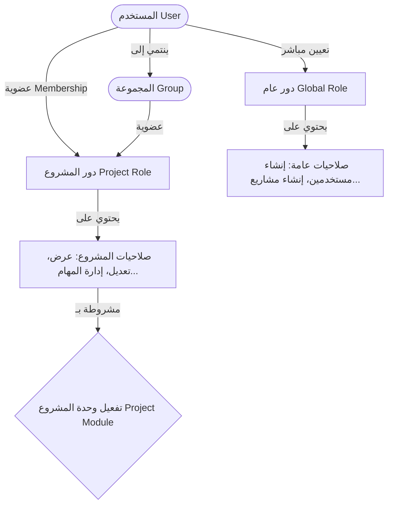

# بحث توثيقي شامل: نظام الصلاحيات في منصة OpenProject
>
> **المصدر**: التوثيق الرسمي لمنصة OpenProject ومستودع الشيفرة البرمجية المفتوح المصدر (Core Architecture & System Admin Guide).  
> **تاريخ الإعداد**: أكتوبر 2026  
> **الحالة**: بحث رسمي معتمد وموثق

---

## الفهرس العام

1. [المقدمة والنموذج المفاهيمي (Conceptual RBAC Model)](#1-المقدمة-والنموذج-المفاهيمي)
2. [الجهات الفاعلة في النظام (Principals)](#2-الجهات-الفاعلة-في-النظام-principals)
3. [تصنيف الأدوار وتدرج النطاقات (Role Types & Scopes)](#3-تصنيف-الأدوار-وتدرج-النطاقات)
   - [3.1 دور مدير النظام (Administrator)](#31-دور-مدير-النظام-administrator)
   - [3.2 الأدوار العامة (Global Roles)](#32-الأدوار-العامة-global-roles)
   - [3.3 أدوار المشاريع (Project Roles)](#33-أدوار-المشاريع-project-roles)
   - [3.4 الأدوار النظامية المدمجة (Built-in Roles)](#34-الأدوار-النظامية-المدمجة-built-in-roles)
   - [3.5 أدوار الكيانات الفردية (Entity-Specific Roles & Work Package Sharing)](#35-أدوار-الكيانات-الفردية-entity-specific-roles)
4. [آلية تعريف الصلاحيات برمجياً وتكامل الوحدات (Modules & Definitions)](#4-آلية-تعريف-الصلاحيات-برمجياً)
5. [طبقات فرض الصلاحيات وتدقيقها (Enforcement & Verification Layers)](#5-طبقات-فرض-الصلاحيات-وتدقيقها)
   - [5.1 طبقة العقود (Contracts Layer)](#51-طبقة-العقود-contracts-layer)
   - [5.2 طبقة استعلامات وقواعد البيانات (Scopes & SQL Isolation)](#52-طبقة-استعلامات-وقواعد-البيانات-scopes)
   - [5.3 طبقة التحكم وواجهات البرمجة (Controllers & API Endpoints)](#53-طبقة-التحكم-وواجهات-البرمجة)
   - [5.4 طبقة الواجهة الأمامية وواجهات HAL+JSON (Frontend & ModelAuthService)](#54-طبقة-الواجهة-الأمامية-وواجهات-haljson)
6. [التكامل مع مسارات العمل والأنواع (Workflows & Types)](#6-التكامل-مع-مسارات-العمل-والأنواع)
7. [الاعتبارات الأمنية والخصائص السلوكية المتقدمة](#7-الاعتبارات-الأمنية-والخصائص-السلوكية-المتقدمة)
8. [تقرير ومصفوفة الصلاحيات (Permissions Report)](#8-تقرير-ومصفوفة-الصلاحيات-permissions-report)
9. [المصادر والمراجع الرسمية](#9-المصادر-والمراجع-الرسمية)

---

## 1. المقدمة والنموذج المفاهيمي

يعتمد نظام الأذونات في **OpenProject** على معيار **التحكم في الوصول القائم على الأدوار (Role-Based Access Control - RBAC)**، وهو نموذج متقدم يتميز بالمرونة وقابلية التوسع لتلبية احتياجات إدارة المشاريع التقليدية والمرنة (Agile/Scrum/Kanban).

### المبادئ الأساسية لنظام RBAC في OpenProject

1. **الفصل بين الصلاحية والدور**: لا تُمنح الصلاحيات (`Permissions`) للمستخدمين بشكل مباشر أبداً، بل تُجمع الصلاحيات داخل **أدوار** (`Roles`)، وتُسند الأدوار للمستخدمين أو المجموعات.
2. **سياق النطاق (Scoped Authorization)**: الصلاحيات ليست متجانسة في نطاق تطبيقها؛ فالبعض منها ينطبق على مستوى بيئة النظام كاملة (`Global`)، والبعض الآخر محصور في مشروع بعينه (`Project-scoped`)، وهناك صلاحيات تنطبق على مستوى كيان منفرد (`Resource/Entity-scoped`).
3. **تعددية الأدوار وتراكم الصلاحيات (Additive Permissions)**: يمكن للمستخدم الواحد أن يمتلك عدة أدوار داخل نفس المشروع؛ وفي هذه الحالة تُجمع الصلاحيات (Union / Additive Model)، حيث يمتلك المستخدم أي صلاحية يتيحها له أي من أدواره المسندة.



---

## 2. الجهات الفاعلة في النظام (Principals)

في البنية التحتية لـ OpenProject، يُعامل كل كيان يمكنه تنفيذ إجراء أو حيازة دور كـ `Principal`. وتتفرع هذه الكيانات إلى:

1. **المستخدم الفعلي (Registered User)**:
   - يمثل فرداً حقيقياً يمتلك حساباً وبيانات دخول، ويمكن إسناد أدوار عامة أو أدوار مشاريع له.
2. **المجموعات (User Groups)**:
   - وسيلة لتجميع عدة مستخدمين معاً؛ عند إسناد دور لمجموعة داخل مشروع، يرث كافة أعضاء المجموعة هذا الدور تلقائياً.
3. **المستخدمون الوهميون (Placeholder Users)**:
   - حسابات لا يمكنها تسجيل الدخول، وتُستخدم لحجز الموارد وتوزيع المهام والتخطيط قبل تعيين أعضاء الفريق الفعليين.
4. **المستخدم غير المسجل (Anonymous)**:
   - يمثل الزائر العام عبر الويب الذي يتصفح النظام دون تسجيل دخول، ويخضع لقيود الدور المدمج `Anonymous`.

---

## 3. تصنيف الأدوار وتدرج النطاقات

تُصنّف الأدوار في OpenProject برمجياً وإدارياً إلى 5 أنماط رئيسية تحدد مجال تأثيرها وسلوكها:

### 3.1 دور مدير النظام (Administrator)

- **النطاق**: أعلى مستوى في التطبيق (`Application-level / Superuser`).
- **الخصائص**:
  - يمتلك صلاحية كاملة وغير مقيدة للوصول إلى كافة الإعدادات والمشاريع والملفات والعمليات.
  - لا يمكن تعديل صلاحيات هذا الدور أو تقييدها.
  - يتجاوز دور المدير جميع فحوصات الأمان البرمجية (`user.admin? == true`).
  - تشمل وظائفه: إدارة الخوادم، النسخ الاحتياطي، تهيئة حقول التخصيص (`Custom Fields`)، إعدادات المصادقة (OAuth/SAML/LDAP)، وإنشاء الأدوار وإسناد الامتيازات الإدارية.

---

### 3.2 الأدوار العامة (Global Roles)

- **النطاق**: بيئة النظام ككل (`Instance-wide / Non-project-bound`).
- **الهدف**: تفويض مهام إدارية محددة للمستخدمين دون ترقيتهم إلى مدراء كاملين للمنصة (`Delegated Administration`).
- **قائمة الصلاحيات العامة المتاحة رسمياً**:
  - **Create projects**: إنشاء مشاريع رئيسية جديدة.
  - **Create portfolios**: إنشاء محافظ استثمارية للمشاريع.
  - **Create programs**: إنشاء برامج عمل استراتيجية.
  - **Create backups**: أخذ نسخ احتياطية واستعادتها عبر واجهة الويب.
  - **Create users**: إنشاء حسابات مستخدمين جديدة.
  - **Edit users**: تعديل بيانات وحسابات المستخدمين الحاليين (*ملاحظة أمنية: تتيح تعديل سمات غير المدراء بما فيها البريد الإلكتروني*).
  - **View all users and groups**: استعراض كافة المستخدمين والمجموعات في النظام وتجاوز قيود الرؤية المحصورة بالمشاريع المشتركة.
  - **Create, edit, and delete placeholder users**: إدارة المستخدمين الوهميين للتخطيط وتعيين الموارد.
  - **View all users' mail addresses**: إظهار البريد الإلكتروني للمستخدمين حتى في حال تفعيل خيار إخفاء العناوين.
  - **Edit attribute help texts**: تعديل النصوص التوضيحية المساعدة للحقول والسمات.
  - **Manage public project lists**: إدارة وتعديل قوائم المشاريع العامة.

---

### 3.3 أدوار المشاريع (Project Roles)

- **النطاق**: محصورة داخل سياق مشروع محدد (`Project-scoped`).
- **الخصائص**:
  - تُعيّن للمستخدم أو المجموعة عبر رابطة العضوية (`Membership`).
  - يمكن للمستخدم أن يمتلك دوراً مختلفاً في كل مشروع (مثلاً: مدير مشروع في Project A، وعضو عادي في Project B).
  - يمكن تخصيصها بالكامل وإضافة أي مجموعة من الصلاحيات التابعة للوحدات المتاحة.
  - تخضع لقاعدة **تفعيل الوحدة (Module Dependency)**: إذا لم تكن وحدة معينة (مثل Wiki أو Boards أو Budgets) مفعّلة في إعدادات المشروع، تُلغى تلقائياً كافة صلاحيات تلك الوحدة ولا تظهر للمستخدم حتى لو تضمنها دوره.

---

### 3.4 الأدوار النظامية المدمجة (Built-in Roles)

توفر OpenProject 3 أدوار نظامية مدمجة لا يمكن حذفها، ويتم ضبط صلاحياتها مركزياً:

| الدور المدمج | نوع النطاق | الفئة المستهدفة | السلوك الافتراضي وحالات الاستخدام |
| :--- | :--- | :--- | :--- |
| **Non-member (غير الأعضاء)** | Project-level | المستخدمون المسجلون الذين لم يُضافوا كأعضاء في مشروع عام (`Public Project`). | يحدد ما يمكن للمستخدم المسجل رؤيته أو التفاعل معه في المشاريع العامة التابعة للمؤسسة (مثل إضافة تذاكر أو استعراض لوحات كانبان). |
| **Anonymous (المجهول)** | Project-level | الزوار غير المسجلين (بدون تسجيل دخول). | يُطبق عندما يكون الوصول العام مفعل في المنصة والمشروع محدد كـ `Public`. يسمح بتصفح الوثائق والمهام دون إمكانية التعديل غير المصرح به. |
| **Standard (الافتراضي)** | Application-level | جميع مستخدمي المنصة المعتمدين. | يُطبق تلقائياً على كل مستخدم مسجل؛ لا يمكن استبعاد المستخدمين منه، ويُستخدم لمنح صلاحيات عامة دنيا (مثل استعراض العناوين البريدية). |

---

### 3.5 أدوار الكيانات الفردية (Entity-Specific Roles & Work Package Sharing)

- بداية من الإصدارات الحديثة لـ OpenProject، تم إدخال مفهوم **مشاركة حزم العمل المنفردة (`Work Package Sharing`)**.
- في الواجهة الخلفية، تُدار هذه الصلاحيات عبر نموذج خاص `WorkPackageRole`.
- تتيح مشاركة مهمة أو تذكرة بعينها مع مستخدم خارجي أو غير عضو في المشروع، ومنحه أحد المستويات المخصصة:
  1. **View**: استعراض تفاصيل حزمة العمل ومرفقاتها فقط.
  2. **Comment**: إضافة تعليقات وملاحظات دون تعديل الحقول الرئيسية.
  3. **Edit**: إمكانية تعديل الحقول والحالة والمرفقات لتلك المهمة تحديداً.

---

## 4. آلية تعريف الصلاحيات برمجياً وتكامل الوحدات

تُسجل وتُدار الصلاحيات داخل نواة المنصة بواسطة فئة التحكم بالوصول `OpenProject::AccessControl`:

### 1. موقع التعريف

- تُعرف صلاحيات النواة في الملف: [`config/initializers/permissions.rb`](https://github.com/opf/openproject/tree/dev/config/initializers/permissions.rb).
- تُعرف صلاحيات الإضافات والوحدات المستقلة داخل ملف المحرك لكل إضافة: `modules/<module_name>/lib/<module_name>/engine.rb` (مثل `budgets`، `meetings`، `reporting`).

### 2. بنية المخطط البرمجي (DSL)

```ruby
OpenProject::AccessControl.map do |map|
  # 1. صلاحيات عامة (Global)
  map.permission :add_project,
                 { projects: %i[new create] },
                 global: true

  # 2. صلاحيات تابعة لوحدة مشروع (Project Module)
  map.project_module :work_package_tracking do |pmap|
    pmap.permission :view_work_packages,
                    { work_packages: %i[index show] },
                    permissible_on: :project
                    
    pmap.permission :edit_work_packages,
                    { work_packages: %i[edit update] },
                    permissible_on: %i[project work_package]
  end
end
```

### 3. معاملات التهيئة المهمة

- `global: true`: يحدد أن الصلاحية ذات نطاق عام ولا تتبع مشروعاً.
- `permissible_on:`: يحدد السياقات المقبولة لفحص الصلاحية (`:project`، `:work_package`، أو `:global`). يمنع فحص الصلاحيات في غير سياقها الصحيح برمجياً، ويطلق استثناء `IllegalPermissionContextError` إذا خولفت القاعدة.
- `dependencies`: تحديد الصلاحيات التابعة التي لا تعمل هذه الصلاحية إلا بوجودها.

---

## 5. طبقات فرض الصلاحيات وتدقيقها

يعتمد OpenProject هندسة دفاعية متعددة الطبقات (Multi-layered Authorization Architecture) لضمان عدم تسريب البيانات أو تجاوز الصلاحيات:

```
[ Frontend: Angular & Primer ]
       │ (يفحص الروابط عبر ModelAuthService)
       ▼
[ REST API / Controllers Layer ]
       │ (before_action :authorize / after_validation)
       ▼
[ Contracts Layer (Validation & Business Rules) ]
       │ (التحقق من إمكانية الحفظ وتعديل الحقول والقيم المتاحة)
       ▼
[ Query Scopes & SQL Isolation (ActiveRecord) ]
       │ (دمج قيود الأمان مباشرة داخل استعلامات SQL عبر Project.allowed_to)
       ▼
[ Database (PostgreSQL) ]
```

### 5.1 طبقة العقود (Contracts Layer)

- هي المكان الموصى به برمجياً في بنية OpenProject للتحقق من الصلاحيات عند إجراء أي تعديل أو إنشاء (`Mutations`).
- تتحقق العقود من:
  - هل يملك المستخدم الصلاحية لتنفيذ العملية؟
  - هل يملك الصلاحية لتعديل حقل معين بعينه؟
  - **القيم المسموح إسنادها (Assignable Values)**: على سبيل المثال، التحقق مما إذا كان المستخدم يملك صلاحية `become_assignee_or_responsible` ليظهر اسمه ضمن قائمة المعينين لحزم العمل.

---

### 5.2 طبقة استعلامات وقواعد البيانات (Scopes & SQL Isolation)

- لتفادي التحقق من الصلاحيات بعد جلب البيانات (مما يسبب بطئاً شديداً ومخاطر تسريب)، تُدمج الصلاحيات داخل استعلامات SQL مباشرة.
- أهم النطاقات المعتمدة:
  - `Project.allowed_to(user, permission)`: جلب المشاريع التي يمتلك فيها المستخدم صلاحية معينة.
  - `WorkPackage.allowed_to(user, permission)`: استرجاع حزم العمل المصرح بها للمستخدم.
  - `Model.visible`: نطاق موحد على جميع الكيانات، يضمن عزل السجلات غير المصرح بها على مستوى قاعدة البيانات.
  - **استراتيجية الإخفاء التام (404 Not Found بدلاً من 403 Forbidden)**: عند محاولة الوصول المباشر لكائن غير مصرح به، يرمي النظام استثناء `RecordNotFound` لينتج خطأ 404، منعاً لاكتشاف وجود الكيان من قبل أطراف غير مخولة.

---

### 5.3 طبقة التحكم وواجهات البرمجة (Controllers & API Endpoints)

- استدعاء `before_action :authorize` في وحدات التحكم للتحقق التلقائي بناءً على المخطط المسجل في `AccessControl`.
- الفحص الصريح داخل الكود يتم عبر دوال حديثة مدققة السياق:
  - `user.allowed_in_project?(permission, project)`
  - `user.allowed_globally?(permission)`
  - `user.allowed_in_work_package?(permission, work_package)`
  - `user.allowed_in_any_project?(permission)`

---

### 5.4 طبقة الواجهة الأمامية وواجهات HAL+JSON

- واجهة برمجة تطبيقات OpenProject (API v3) تتبع معيار **HAL+JSON** (Hypertext Application Language).
- تتضمن كائنات الاستجابة مصفوفة روابط العمليات المصرح بها في حقل `_links` (مثل رابط `createWorkPackage` أو `update`).
- في الواجهة الأمامية (Angular)، تقوم خدمة `ModelAuthService` بفحص وجود رابط العملية:

  ```typescript
  // فحص ما إذا كان للمستخدم صلاحية إنشاء مهمة
  if (modelAuthService.can('work_packages', 'createWorkPackage')) {
      // إظهار زر "مهمة جديدة"
  }
  ```

- **الميزة**: الواجهة الأمامية لا تحتاج لمعرفة تفاصيل الأدوار أو ما إذا كانت الوحدة مفعلة في المشروع؛ فغياب الرابط من استجابة الـ API يعني تلقائياً منع العملية.

---

## 6. التكامل مع مسارات العمل والأنواع (Workflows & Types)

ترتبط الصلاحيات في OpenProject ارتباطاً وثيقاً بـ **مسارات العمل (Workflows)**:

1. **تحديد الحالات والتحولات**:
   - لا تكفي صلاحية `Edit work packages` لتغيير حالة المهمة إلى أي حالة عشوائية.
   - يحدد مسار العمل لكل **دور** (`Role`) ولكل **نوع مهمة** (`Work Package Type`) ما هي التحولات المسموحة (مثال: الانتقال من *جديد* إلى *قيد التنفيذ* مسموح لدور *المطور*، لكن الانتقال إلى *مغلق* محصور بدور *مدير المشروع*).
2. **صلاحية تعديل الحقول حسب الحالة (Read-only attributes per status)**:
   - يتيح جدول سير العمل تحديد حقول معينة للقراءة فقط عند بلوغ حالة محددة، مما يقيّد صلاحية التعديل الاعتيادية.
3. **نسخ مسارات العمل**:
   - عند إنشاء دور جديد، يمكن نسخ مصفوفة سير العمل بالكامل من دور سابق لتوفير الوقت.

---

## 7. الاعتبارات الأمنية والخصائص السلوكية المتقدمة

خلال مراجعة المصادر الرسمية لنظام الصلاحيات في OpenProject، تبرز عدة نقاط أمنية وسلوكية بالغة الأهمية:

### 1. كشف المعرفات الفريدة للمشاريع (Project Identifier Visibility)

- تتطلب المنصة أن يكون المعرف النصي لكل مشروع (`Identifier` المستخدم في الرابط URL و API) فريداً على مستوى المنصة ككل.
- عند قيام مستخدم يملك صلاحية `Create projects` أو `Create subprojects` بإنشاء مشروع واختبار اسم المعرف، يمكنه استنتاج ما إذا كان المعرف محجوزاً بالفعل لمشروع آخر حتى لو كان ذلك المشروع سرياً ومخفياً عنه.
- **التوصية الرسمية**: عدم منح صلاحية إنشاء المشاريع لغير المخولين إذا كانت أسماء المعرفات الحساسة قد تكشف وجود مشاريع استراتيجية سرية.

### 2. خطر انتحال الهوية عند تفويض تعديل المستخدمين (Edit Users Risk)

- تتيح الصلاحية العامة `Edit users` للمستخدم تعديل سمات الحسابات الأخرى في النظام (باستثناء حسابات المدراء الكاملين).
- يمكن لحامل هذه الصلاحية تغيير عنوان البريد الإلكتروني لحساب مستخدم آخر إلى عنوان تحت سيطرته وطلب استعادة كلمة المرور، مما يمكنه من انتحال هوية المستخدم.
- **التوصية الرسمية**: التعامل مع صلاحية `Edit users` بحذر شديد وقصرها على موظفي الموارد البشرية أو الدعم الفني الموثوق بهم.

### 3. الصلاحيات المستقلة للمهام (Independent Task Permissions)

- صلاحية `Add attachments` (إضافة مرفقات) وصلاحية `Change work package status` (تغيير الحالة) تعملان بشكل **مستقل** تماماً عن صلاحية `Edit work packages`، مما يسمح بإنشاء أدوار مقيدة تستطيع إرفاق ملفات أو تحديث الحالة فقط دون تعديل متن المهمة.

### 4. صلاحيات نسخ المشاريع (Copy Projects)

- المستخدم الذي يقوم بنسخ مشروع يحصل تلقائياً في المشروع الجديد على الدور المحدد في إعدادات النظام تحت اسم: **"New role for users that create projects"**، وقد يمنحه هذا الدور صلاحيات أوسع في النسخة الجديدة مقارنة بالمشروع الأصلي.

---

## 8. تقرير ومصفوفة الصلاحيات (Permissions Report)

توفر منصة OpenProject واجهة مصفوفة مركزية لإدارة ومراجعة الصلاحيات عبر المسار:
`Administration > Users and permissions > Permissions report`

### خصائص التقرير

- **المصفوفة الأفقية/العمودية**: يعرض كافة الأدوار المعرفة كأعمدة، وجميع الصلاحيات مصنفة بحسب وحداتها الوظيفية كصفوف.
- **التعديل المباشر**: يمكن تفعيل أو تعطيل أي صلاحية لأي دور من خلال مربعات الاختيار وحفظ التغييرات دفعة واحدة.
- **التدقيق الأمني (Auditability)**: يوفر للمدراء نظرة شاملة لمراجعة مبدأ "الحد الأدنى من الامتيازات" (Least Privilege Principle) والتحقق من عدم منح أدوار غير الأعضاء صلاحيات فائضة.

---

## 9. المصادر والمراجع الرسمية

1. **دليل صلاحيات OpenProject الرسمي**:
   - [OpenProject System Admin Guide - Permissions Guide](https://www.openproject.org/docs/system-admin-guide/users-permissions/permissions-guide/)
2. **إدارة الأدوار والصلاحيات في التوثيق الرسمي**:
   - [OpenProject System Admin Guide - Roles and Permissions](https://www.openproject.org/docs/system-admin-guide/users-permissions/roles-permissions/)
3. **دليل المفاهيم البرمجية لنظام الصلاحيات (Architecture Concept)**:
   - [OpenProject Developer Documentation - Permissions Concept](https://www.openproject.org/docs/development/concepts/permissions/)
4. **شفرة المصدر البرمجية لنظام التحكم في الوصول (OpenProject Source Code)**:
   - [GitHub: opf/openproject - lib/open_project/access_control.rb](https://github.com/opf/openproject/blob/dev/lib/open_project/access_control.rb)
   - [GitHub: opf/openproject - config/initializers/permissions.rb](https://github.com/opf/openproject/blob/dev/config/initializers/permissions.rb)
5. **توثيق واجهة برمجة التطبيقات (API v3)**:
   - [OpenProject API v3 Documentation - Endpoints Index](https://www.openproject.org/docs/api/endpoints/)
