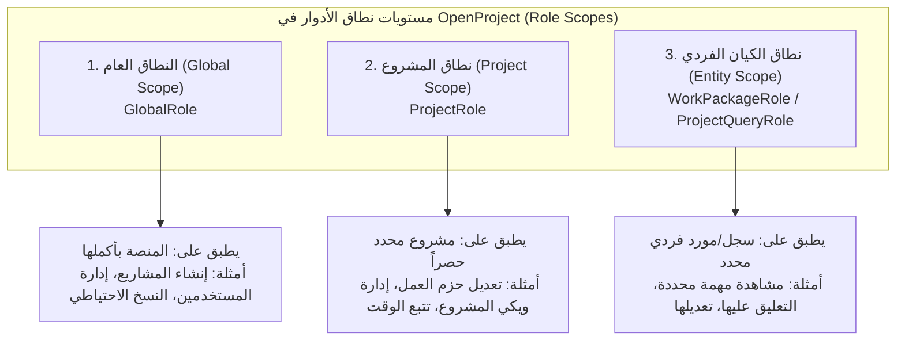

# بحث توثيقي تخصصي: النطاق في الأدوار (Scope in Roles) في منصة OpenProject

> **المصدر**: المصادر الرسمية لمنصة OpenProject (دليل إدارة النظام System Admin Guide ومستودع الشيفرة البرمجية المفتوح `opf/openproject`).  
> **الإصدارات المرجعية المستهدفة**: OpenProject 13.x و 14.x وحتى أحدث معمارية في 15.0+  
> **المجلد والمسار**: `docs/openproject_roles_scope_research.md`  
> **تاريخ الإعداد**: أكتوبر 2026  
> **الحالة**: بحث توثيقي مرجعي شامل.

---

## الفهرس العام

1. [المقدمة والمفهوم العام للنطاق في الأدوار (Role Scope)](#1-المقدمة-والمفهوم-العام-للنطاق-في-الأدوار)
2. [المستويات الوظيفية لنطاقات الأدوار (التصنيف الإداري الرسمي)](#2-المستويات-الوظيفية-لنطاقات-الأدوار-التصنيف-الإداري-الرسمي)
   - [2.1 النطاق العام للنظام (Global Scope / Application-Level)](#21-النطاق-العام-للنظام-global-scope--application-level)
   - [2.2 نطاق المشروع (Project Scope / Project-Level)](#22-نطاق-المشروع-project-scope--project-level)
   - [2.3 نطاق الكيان الفردي والمشاركة (Entity / Resource-Level Scope)](#23-نطاق-الكيان-الفردي-والمشاركة-entity--resource-level-scope)
3. [الهيكلية البرمجية ونمط الوراثة في جدول واحد (Role STI Architecture)](#3-الهيكلية-البرمجية-ونمط-الوراثة-في-جدول-واحد-role-sti-architecture)
   - [3.1 الفئة الأساسية المجردة `Role`](#31-الفئة-الأساسية-المجردة-role)
   - [3.2 الفئات المشتقة (`GlobalRole`, `ProjectRole`, `WorkPackageRole`, `ProjectQueryRole`)](#32-الفئات-المشتقة-globalrole-projectrole-workpackagerole-projectqueryrole)
   - [3.3 الأدوار المضمنة النظامية (Built-in Roles)](#33-الأدوار-المضمنة-النظامية-built-in-roles)
4. [هندسة العضوية والربط بحسب النطاق (`Member` & `MemberRole`)](#4-هندسة-العضوية-والربط-بحسب-النطاق-member--memberrole)
   - [4.1 معمارية نموذج `Member` متعدد الأشكال (Polymorphic Membership)](#41-معمارية-نموذج-member-متعدد-الأشكال-polymorphic-membership)
   - [4.2 استعلامات النطاق (ActiveRecord Scopes) في العضويات](#42-استعلامات-النطاق-activerecord-scopes-في-العضويات)
5. [عقود التحقق وعزل الصلاحيات بحسب نطاق الدور (`Contracts & Validation`)](#5-عقود-التحقق-وعزل-الصلاحيات-بحسب-نطاق-الدور-contracts--validation)
   - [5.1 آلية `assignable_permissions` في `Roles::BaseContract`](#51-آلية-assignable_permissions-في-rolesbasecontract)
   - [5.2 استحالة تغيير نطاق الدور بعد إنشائه ومحددات `Roles::CreateContract`](#52-استحالة-تغيير-نطاق-الدور-بعد-إنشائه-ومحددات-rolescreatecontract)
   - [5.3 التحقق من الشروط المسبقة والتبعيات (`check_permission_prerequisites`)](#53-التحقق-من-الشروط-المسبقة-والتبعيات-check_permission_prerequisites)
6. [نطاق دور منشئ المشروع (Project Creator Role)](#6-نطاق-دور-منشئ-المشروع-project-creator-role)
7. [الدور العالمي القياسي (Standard Global Role - المعيار الحديث في 15.0+)](#7-الدور-العالمي-القياسي-standard-global-role---المعيار-الحديث-في-150)
8. [جدول المقارنة الشامل بين نطاقات الأدوار](#8-جدول-المقارنة-الشامل-بين-نطاقات-الأدوار)
9. [المصادر والمراجع الرسمية](#9-المصادر-والمراجع-الرسمية)

---

## 1. المقدمة والمفهوم العام للنطاق في الأدوار

في نظام إدارة المشاريع **OpenProject**، لا يُعد "الدور" (Role) مجرد قائمة اعتباطية من الصلاحيات، بل هو **وعاء لصلاحيات مقيدة بنطاق محدد مسبقاً (Scoped Permission Container)**.

### ما هو "نطاق الدور" (Role Scope)؟

نطاق الدور هو **الحدود البيئية والتطبيقية (Context Boundary) التي تكون الصلاحيات الممنوحة من خلال هذا الدور سارية المفعول ضمنها**.

تاريخياً في أنظمة Redmine و ChiliProject، كانت الأدوار تُعامل بشكل شبه كامل على مستوى المشاريع فقط. ولكن مع نضوج OpenProject وتحوله إلى منصة تعاون وتخطيط مؤسسية، نشأت الحاجة لفصل الأدوار إلى مستويات نطاق متدرجة:

1. **أدوار النظام العام**: لإدارة الحسابات والمشاريع العامة دون الحاجة لمنح المستخدم صلاحيات "مدير نظام كامل" (Admin).
2. **أدوار المشاريع**: لإدارة فرق العمل ومخرجات المشاريع بحسب الوحدات المنشطة.
3. **أدوار الكيانات الفردية (Granular Entity Roles)**: لمشاركة مهام معينة (Work Packages) أو استعلامات مشاريع مع أشخاص من خارج المشروع دون كشف بقية المشروع.



---

## 2. المستويات الوظيفية لنطاقات الأدوار (التصنيف الإداري الرسمي)

بحسب دليل مسؤولي النظام الرسمي في OpenProject (**System Admin Guide: Roles and Permissions**)، تُقسم الأدوار وظيفياً إلى ثلاثة مستويات رئيسية:

### 2.1 النطاق العام للنظام (Global Scope / Application-Level)

تُطبق هذه الأدوار على **مستوى تثبيت المنصة بالكامل** وتكون مستقلة عن أي مشروع محدد.

- **الهدف**: تفويض المهام الإدارية لمستخدمين معينين دون منحهم دور "مدير النظام" الكامل (`Administrator`).
- **طريقة الإنشاء والتعيين**:
  - يتم تفعيل خيار **`Global role`** عند إنشاء الدور في لوحة الإدارة (`Administration > Users and permissions > Roles and permissions`).
  - يتم إسناد الدور العام للمستخدم عبر صفحة تفاصيل المستخدم (`Administration > Users > [User] > Global roles`).
- **أمثلة الصلاحيات الحصرية لهذا النطاق**:
  - `create_projects`: إنشاء مشاريع جديدة.
  - `create_users` و `edit_users`: تفويض إدارة وتعديل المستخدمين.
  - `view_all_users_and_groups`: رؤية كافة مستخدمي ومجموعات النظام.
  - `create_backups`: أخذ نسخ احتياطية للمنصة من الواجهة.
  - `manage_public_project_lists`: تنظيم وتعديل قوائم المشاريع العامة.
  - `create_portfolios` و `create_programs`: إنشاء المحافظ والبرامج الاستراتيجية.
  - `edit_attribute_help_texts`: تعديل النصوص المساعدة للحقول.
  - `create_edit_delete_placeholder_users`: إدارة المستخدمين الشكليين / المؤقتين.

> [!NOTE]
> لا يمكن تحويل دور عام (Global Role) إلى دور مشروع (Project Role) لاحقاً، حيث يتم قفل النمط عند الإنشاء.

---

### 2.2 نطاق المشروع (Project Scope / Project-Level)

هذا هو النطاق التقليدي والأكثر استخداماً في المنصة؛ حيث تنحصر صلاحيات هذا الدور في **حدود مشروع بعينه**.

- **الهدف**: تحديد ما يمكن للعضو فعله داخل مشروع معين (قد يمتلك المستخدم دور "مدير مشروع" في مشروع (أ)، بينما يمتلك دور "مشاهد فقط" في مشروع (ب)).
- **طريقة الإنشاء والتعيين**:
  - يُنشأ بعدم تفعيل خيار `Global role`.
  - يتم إسناده للأعضاء داخل وحدة الأعضاء في المشروع (`[Project] > Project settings > Members`).
  - يمكن تعيين أكثر من دور مشروع للمستخدم نفسه في نفس المشروع (فتُجمع الصلاحيات اتحادياً Union).
- **أقسام صلاحيات نطاق المشروع**:
  - صلاحيات حزم العمل (Work packages: View, Create, Edit, Delete, Assign, Share, Move).
  - صلاحيات التقدير والوقت (Time tracking, Log time for other users, View costs).
  - صلاحيات الوحدات التشاركية (Wiki, Forums, Calendars, Meetings, News).
  - صلاحيات إدارة المشروع نفسه (Edit project, Select project modules, Manage members).

---

### 2.3 نطاق الكيان الفردي والمشاركة (Entity / Resource-Level Scope)

بدءاً من الإصدار 13.x تم إدخال ميزة **Work Package Sharing** (مشاركة حزم العمل المفردة). وتطلب ذلك ابتكار نطاق أدوار جديد لا يرتبط بمشروع كامل، بل بـ **كيان (Entity) فردي محدد**.

- **الهدف**: تمكين المستخدمين الخارجيين أو غير الأعضاء في المشروع من الاطلاع على مهمة محددة أو التعليق عليها دون منحهم حق الوصول لبقية محتويات المشروع.
- **الأدوار الرسمية في هذا النطاق**:
  - **WorkPackageRole**:
    1. `Viewer` (مشاهد للمهمة فقط).
    2. `Commenter` (مشاهد ومعلق على المهمة).
    3. `Editor` (محرر لبيانات المهمة وحقولها).
  - **ProjectQueryRole**:
    1. `View` (مشاهدة استعلام المشروع المحفوظ والمشارك).
    2. `Edit` (تعديل استعلام المشروع).
- **خصائص الإدارة**:
  - هذه الأدوار هي أدوار نظامية مضمنة تُدار تلقائياً ولا تظهر في جدول إدارة الأدوار العام (مدرجة ضمن مصفوفة `Role::HIDDEN_ROLE_TYPES`).

---

## 3. الهيكلية البرمجية ونمط الوراثة في جدول واحد (Role STI Architecture)

في النواة البرمجية لـ OpenProject (مستودع `opf/openproject`)، يُنفذ نطاق الدور هندسياً باستخدام نمط **الوراثة في جدول واحد (Single Table Inheritance - STI)** في إطار عمل Rails.

### 3.1 الفئة الأساسية المجردة `Role`

توجد في المسار [`app/models/role.rb`](https://github.com/opf/openproject/blob/dev/app/models/role.rb)، وهي فئة تجريدية ترتبط بجدول `roles` في قاعدة البيانات.

```ruby
class Role < ApplicationRecord
  include Lists::MoveAfterAnchor

  SORTABLE_LIST_TYPE = "role"

  # Built-in roles constants
  NON_BUILTIN                    = 0
  BUILTIN_NON_MEMBER             = 1
  BUILTIN_ANONYMOUS              = 2
  BUILTIN_WORK_PACKAGE_VIEWER    = 3
  BUILTIN_WORK_PACKAGE_COMMENTER = 4
  BUILTIN_WORK_PACKAGE_EDITOR    = 5
  BUILTIN_PROJECT_QUERY_VIEW     = 6
  BUILTIN_PROJECT_QUERY_EDIT     = 7
  BUILTIN_STANDARD_GLOBAL        = 8

  # الأدوار التي يتم إخفاؤها بصرياً من واجهة إدارة الأدوار
  HIDDEN_ROLE_TYPES = [
    "WorkPackageRole",
    "ProjectQueryRole"
  ].freeze

  # إجبار الفئة على العمل كـ Abstract Class عبر التحقق من عمود STI: `type`
  validates :type,
            inclusion: { in: ->(*) { Role.subclasses.map(&:to_s) } }

  has_many :member_roles, dependent: :destroy
  has_many :members, through: :member_roles
  has_many :role_permissions, dependent: :destroy
  ...
```

---

### 3.2 الفئات المشتقة (Subclasses of `Role`)

يقسم محرك OpenProject الفئات المشتقة من `Role` بحسب النطاق إلى أربعة نماذج أساسية داخل `app/models/`:

#### 1. الفئة `GlobalRole < Role`

توجد في [`app/models/global_role.rb`](https://github.com/opf/openproject/blob/dev/app/models/global_role.rb):

```ruby
class GlobalRole < Role
  def self.givable
    super
      .where(type: "GlobalRole")
  end

  def self.standard
    standard_global_role = where(builtin: BUILTIN_STANDARD_GLOBAL).first
    if standard_global_role.nil?
      standard_global_role = create(name: "Standard global role", position: 0) do |role|
        role.builtin = BUILTIN_STANDARD_GLOBAL
      end
    end
    standard_global_role
  end
end
```

#### 2. الفئة `ProjectRole < Role`

توجد في [`app/models/project_role.rb`](https://github.com/opf/openproject/blob/dev/app/models/project_role.rb):

```ruby
class ProjectRole < Role
  # الصلاحيات الإلزامية التي يجب أن يمتلكها الدور ليكون صالحاً لمنشئ المشروع
  PERMISSIONS_FOR_PROJECT_CREATOR = %i[
    view_project
    view_project_attributes
    edit_project_attributes
    view_members
    manage_members
  ].freeze

  has_many :custom_fields_roles, foreign_key: "role_id"

  def self.givable
    super
      .where(type: "ProjectRole")
  end

  def self.non_member
    where(builtin: BUILTIN_NON_MEMBER).first_or_create(...)
  end

  def self.anonymous
    where(builtin: BUILTIN_ANONYMOUS).first_or_create(...)
  end
end
```

#### 3. الفئة `WorkPackageRole < Role`

توجد في [`app/models/work_package_role.rb`](https://github.com/opf/openproject/blob/dev/app/models/work_package_role.rb):

```ruby
class WorkPackageRole < Role
  def self.givable
    super.where(type: "WorkPackageRole")
  end

  def member?
    true
  end
end
```

#### 4. الفئة `ProjectQueryRole < Role`

توجد في [`app/models/project_query_role.rb`](https://github.com/opf/openproject/blob/dev/app/models/project_query_role.rb):

```ruby
class ProjectQueryRole < Role
  def self.givable
    super.where(type: "ProjectQueryRole")
  end

  def member?
    true
  end
end
```

---

### 3.3 الأدوار المضمنة النظامية (Built-in Roles)

تحتوي المنصة على أدوار مسبقة البناء لها سلوك نطاق استثنائي لا يمكن حذفه (`deletable? == false`):

| الثابت البرمجي | المعرّف (Builtin ID) | الفئة (Type) | نطاق التطبيق (Scope) | الوصف والدلالة الوظيفية |
| :--- | :---: | :--- | :--- | :--- |
| `NON_BUILTIN` | `0` | بحسب الإنشاء | متغير (Custom) | أي دور مخصص يتم إنشاؤه يدوياً بواسطة المدير. |
| `BUILTIN_NON_MEMBER` | `1` | `ProjectRole` | مشروع عام | يمثل المستخدمين المسجلين في النظام عند تصفح مشروع عام ليسوا أعضاء صرحاء فيه. |
| `BUILTIN_ANONYMOUS` | `2` | `ProjectRole` | مشروع عام للزوار | يمثل الزوار غير المسجلين عند تفعيل التصفح العام دون تسجيل دخول. |
| `BUILTIN_WORK_PACKAGE_VIEWER` | `3` | `WorkPackageRole` | حزمة عمل محددة | دور مشاهدة مهمة محددة تمت مشاركتها مع المستخدم. |
| `BUILTIN_WORK_PACKAGE_COMMENTER` | `4` | `WorkPackageRole` | حزمة عمل محددة | دور مشاهدة وإضافة تعليقات على مهمة مشاركة. |
| `BUILTIN_WORK_PACKAGE_EDITOR` | `5` | `WorkPackageRole` | حزمة عمل محددة | دور تحرير حقول مهمة مشاركة. |
| `BUILTIN_PROJECT_QUERY_VIEW` | `6` | `ProjectQueryRole` | استعلام محدد | دور مشاهدة استعلام مشروع محدد تمت مشاركته. |
| `BUILTIN_PROJECT_QUERY_EDIT` | `7` | `ProjectQueryRole` | استعلام محدد | دور تحرير استعلام مشروع محدد تمت مشاركته. |
| `BUILTIN_STANDARD_GLOBAL` | `8` | `GlobalRole` | على مستوى المنصة | دور قياسي عام يُطبق تلقائياً على كل مستخدم في النظام (إصدار 15.0+). |

---

## 4. هندسة العضوية والربط بحسب النطاق (`Member` & `MemberRole`)

لا يرتبط المستخدم بالأدوار مباشرة في جدول المستخدمين، بل تتم إدارة العلاقة بين `Principal` (مستخدم أو مجموعة) وبين `Role` عبر كائن وسيط ذكي وهو **`Member`** (العضوية) وجدول الوصل **`MemberRole`**.

### 4.1 معمارية نموذج `Member` متعدد الأشكال (Polymorphic Membership)

توضح الشيفرة في [`app/models/member.rb`](https://github.com/opf/openproject/blob/dev/app/models/member.rb) كيف يتحكم كائن `Member` في نطاق تطبيق الدور:

```ruby
class Member < ApplicationRecord
  ALLOWED_ENTITIES = [
    "WorkPackage",
    "ProjectQuery"
  ].freeze

  belongs_to :principal, foreign_key: "user_id", inverse_of: "members"
  belongs_to :entity, polymorphic: true, optional: true
  belongs_to :project, optional: true

  has_many :member_roles, dependent: :destroy
  has_many :roles, -> { distinct }, through: :member_roles

  # التحقق من أن الكيان يطابق النطاقات المدعومة حصراً
  validates :entity_type, inclusion: { in: ALLOWED_ENTITIES, allow_blank: true }
  validates :user_id, uniqueness: { scope: %i[project_id entity_type entity_id] }
```

#### كيف يترجم كائن `Member` نطاق الدور؟

```
              ┌─────────────────────────┐
              │      Principal (User)   │
              └────────────┬────────────┘
                           │ 1
                           │ has_many
                           ▼ *
              ┌─────────────────────────┐
              │         Member          │
              ├─────────────────────────┤
              │ user_id                 │
              │ project_id (FK, nullable)│
              │ entity_type (polymorphic)│
              │ entity_id (polymorphic) │
              └────────────┬────────────┘
                           │ 1
                           │ has_many
                           ▼ *
              ┌─────────────────────────┐
              │       MemberRole        │
              └────────────┬────────────┘
                           │ *
                           │ belongs_to
                           ▼ 1
              ┌─────────────────────────┐
              │     Role (STI Table)    │
              ├─────────────────────────┤
              │ type (Global/Project/..)│
              │ builtin                 │
              └─────────────────────────┘
```

1. **النطاق العام (Global Membership)**:
   - `project_id = NULL`
   - `entity_id = NULL` و `entity_type = NULL`
   - يرتبط حصراً بأدوار من نوع `GlobalRole`.
2. **نطاق المشروع (Project Membership)**:
   - `project_id = <معرّف المشروع>`
   - `entity_id = NULL` و `entity_type = NULL`
   - يرتبط حصراً بأدوار من نوع `ProjectRole`.
3. **نطاق الكيان الفردي (Entity Membership - مثل WorkPackage)**:
   - `project_id = <مشروع حزمة العمل>`
   - `entity_type = "WorkPackage"`
   - `entity_id = <معرّف حزمة العمل>`
   - يرتبط حصراً بأدوار من نوع `WorkPackageRole`.

---

### 4.2 استعلامات النطاق (ActiveRecord Scopes) في العضويات

يوفر مجلد [`app/models/members/scopes/`](https://github.com/opf/openproject/tree/dev/app/models/members/scopes) استعلامات جاهزة ومعزولة لعزل سجلات العضوية بحسب النطاق:

- **العضويات العامة (`Members::Scopes::Global`)**:

  ```ruby
  def global
    where(project: nil, entity: nil)
  end
  ```

* **عضويات المشروع الصريحة (`Members::Scopes::OfProject`)**:

  ```ruby
  def of_project(project)
    of_any_project.where(project_id: project)
  end
  ```

* **عضويات الكيانات الفردية (`Members::Scopes::OfEntity`)**:

  ```ruby
  def of_entity(entity)
    if entity.respond_to?(:project)
      where(project: entity.project, entity:)
    else
      where(project: nil, entity:)
    end
  end
  ```

---

## 5. عقود التحقق وعزل الصلاحيات بحسب نطاق الدور (`Contracts & Validation`)

تعتمد منصة OpenProject نمط العقود البرمجية (**Trailblazer-style ModelContracts**) في مجلد `app/contracts/roles/` لضمان استحالة تسريب أو خلط الصلاحيات بين النطاقات المختلفة.

### 5.1 آلية `assignable_permissions` في `Roles::BaseContract`

في الفئة المرجعية [`Roles::BaseContract`](https://github.com/opf/openproject/blob/dev/app/contracts/roles/base_contract.rb)، يتم فحص الصلاحيات المسموح بإسنادها للدور عبر مطابقة الفئة البرمجية للدور (`model`):

```ruby
module Roles
  class BaseContract < ::ModelContract
    attribute :name

    validate :check_permission_prerequisites

    def assignable_permissions(keep_public: false)
      case model
      when GlobalRole
        assignable_global_permissions
      when WorkPackageRole
        assignable_work_package_permissions
      when ProjectQueryRole
        assignable_project_query_permissions
      else
        assignable_member_permissions
      end.reject do |permission|
        (!keep_public && permission.public?) || permission.hidden?
      end
    end

    private

    def assignable_global_permissions
      OpenProject::AccessControl.global_permissions
    end

    def assignable_work_package_permissions
      OpenProject::AccessControl.work_package_permissions
    end

    def assignable_project_query_permissions
      OpenProject::AccessControl.project_query_permissions
    end

    def assignable_member_permissions
      permissions_to_remove = case model.builtin
                              when Role::BUILTIN_NON_MEMBER
                                OpenProject::AccessControl.members_only_permissions
                              when Role::BUILTIN_ANONYMOUS
                                OpenProject::AccessControl.loggedin_only_permissions
                              else
                                []
                              end

      OpenProject::AccessControl.project_permissions - permissions_to_remove
    end
```

#### الأثر الهندسي لهذه القاعدة

* يستحيل برمجياً إسناد صلاحية مشروع (مثل `edit_work_packages`) إلى دور عام (`GlobalRole`).
- يستحيل إسناد صلاحية عالمية (مثل `create_projects`) إلى دور مشروع (`ProjectRole`).
- يتم تقييد دور `Non-member` بحذف الصلاحيات المخصصة للأعضاء الصرحاء (`members_only_permissions`).
- يتم تقييد دور `Anonymous` بحذف الصلاحيات التي تتطلب تسجيل الدخول (`loggedin_only_permissions`).

---

### 5.2 استحالة تغيير نطاق الدور بعد إنشائه ومحددات `Roles::CreateContract`

في [`Roles::CreateContract`](https://github.com/opf/openproject/blob/dev/app/contracts/roles/create_contract.rb):

```ruby
module Roles
  class CreateContract < BaseContract
    attribute :type

    validate :type_in_allowed

    private

    def type_in_allowed
      unless [ProjectRole.name, GlobalRole.name].include?(model.type)
        errors.add(:type, :inclusion)
      end
    end
  end
end
```

> [!IMPORTANT]
>
> 1. الأدوار الوحيدة القابلة للإنشاء يدوياً بواسطة مديري النظام عبر الـ API والواجهة هي `ProjectRole` و `GlobalRole`. أما أدوار الكيانات مثل `WorkPackageRole` فهي محصورة داخلياً بالنواة.
> 2. في عقد التعديل `Roles::UpdateContract`، لا توجد سمة `:type` ضمن السمات المسموح بتعديلها؛ مما يعني أن **نطاق الدور غير قابل للتبديل بتاتاً بعد الإنشاء** (Permanent Immutable Scope).

---

### 5.3 التحقق من الشروط المسبقة والتبعيات (`check_permission_prerequisites`)

تفرض المنصة فحصاً لترابط الصلاحيات الشجري داخل نطاق الدور نفسه:

```ruby
def check_permission_prerequisites
  hidden_permissions = OpenProject::AccessControl.permissions.select(&:hidden?).map(&:name)

  model.permissions.each do |name|
    permission = OpenProject::AccessControl.permission(name)
    next unless permission

    unmet_dependencies = permission.dependencies - model.permissions - hidden_permissions

    unmet_dependencies.each do |unmet_dependency|
      add_unmet_dependency_error(name, unmet_dependency)
    end
  end
end
```

*مثال*: لا يمكن منح الدور صلاحية `edit_work_packages` داخل نطاق المشروع دون أن يحتوي الدور أيضاً على صلاحية `view_work_packages`، وإلا سيرفض العقد حفظ الدور.

---

## 6. نطاق دور منشئ المشروع (Project Creator Role)

أحد أهم التحديات التي تم حلها عبر هندسة النطاقات في OpenProject هي مسألة: **ماذا يحدث عندما يقوم مستخدم غير مسؤول (Non-admin) بإنشاء مشروع جديد عبر صلاحية `create_projects` العالمية؟**

1. يمتلك المستخدم في البداية دوراً عاماً (`GlobalRole`) يحتوي على `create_projects`.
2. هذا الدور العام **لا يعطيه أي صلاحيات داخل المشروع الجديد**، لأن نطاق الصلاحيات العالمية منفصل تماماً عن نطاق المشروع!
3. لحل هذه المعضلة، يلزم النظام بوجود دور مشروع محدد يُمنح تلقائياً لمنشئ المشروع (`Setting.new_project_user_role_id`).
4. تفرض الفئة [`ProjectRole`](https://github.com/opf/openproject/blob/dev/app/models/project_role.rb) معياراً صارماً للصلاحيات التي يجب أن يحتويها هذا الدور (`PERMISSIONS_FOR_PROJECT_CREATOR`):

   ```ruby
   PERMISSIONS_FOR_PROJECT_CREATOR = %i[
     view_project
     view_project_attributes
     edit_project_attributes
     view_members
     manage_members
   ].freeze
   ```

5. إذا لم يحتوي الدور المختار على هذه الصلاحيات الأساسية الخمس، فلن يتمكن المنشئ من إكمال إعداد المشروع وإضافة الأعضاء وإدارة سماته.

---

## 7. الدور العالمي القياسي (Standard Global Role - المعيار الحديث في 15.0+)

مع إطلاق إصدار **OpenProject 15.0+**، تم تعزيز مفهوم النطاق العام بإضافة الدور النظامي: **Standard Global Role** (`BUILTIN_STANDARD_GLOBAL = 8`).

### دوافع الإضافة

في الإصدارات السابقة، كان بإمكان كل مستخدم اختيار إخفاء بريده الإلكتروني فردياً من إعدادات حسابه الشخصي ("Hide my email address"). رأت المنظمة أن حوكمة الخصوصية ورؤية البيانات يجب أن تكون قراراً مركزياً لمسؤول المنصة (Organization-wide Policy) وليس قراراً فردياً مشتتاً.

### الخصائص الهندسية للدور القياسي

* **تلقائية الإسناد**: يُطبق هذا الدور حكماً وتلقائياً على **كافة مستخدمي المنصة بلا استثناء** دون الحاجة لإنشاء سجلات `Member` يدوية لكل مستخدم.
- **عدم القابلية للإلغاء أو التعيين**: لا يمكن للمسؤول إضافة مستخدم إليه أو سحب مستخدم منه، ولا يمكن حذفه.
- **إدارة الصلاحيات**: يمكن للمسؤول الدخول إلى:
  `Administration > Users and permissions > Roles and permissions > Standard`
  وتحديد الصلاحيات العامة الافتراضية للجميع، وأهمها:
  - `view_all_users_mail_addresses`: إظهار البريد الإلكتروني للمستخدمين للجميع أو حجبه مركزياً.

---

## 8. جدول المقارنة الشامل بين نطاقات الأدوار

| المحور المقارن | النطاق العام (Global Role) | نطاق المشروع (Project Role) | نطاق الكيان الفردي (WorkPackage Role) |
| :--- | :--- | :--- | :--- |
| **الفئة البرمجية (STI)** | `GlobalRole` | `ProjectRole` | `WorkPackageRole` |
| **نطاق السريان (Context)** | كامل المنصة (`Application-level`) | مشروع محدد بعينه (`Project-level`) | مهمة/حزمة عمل مفردة (`Resource-level`) |
| **طريقة الإسناد** | إعدادات المستخدم (`User > Global roles`) | إعدادات المشروع (`Project > Members`) | زر المشاركة (`Work Package > Share`) |
| **تمثيل العضوية في `Member`** | `project_id: nil`, `entity: nil` | `project_id: X`, `entity: nil` | `project_id: X`, `entity: WorkPackage` |
| **القابلية للإنشاء اليدوي** | نعم (عبر تفعيل خيار Global role) | نعم (الدور الافتراضي) | لا (مضمنة بنظام المشاركة) |
| **الظهور في جدول الأدوار** | ظاهر (`visible: true`) | ظاهر (`visible: true`) | مخفي (`HIDDEN_ROLE_TYPES`) |
| **مجموعة الصلاحيات المتاحة** | `AccessControl.global_permissions` | `AccessControl.project_permissions` | `AccessControl.work_package_permissions` |
| **التأثر بحالة وحدات المشروع** | لا يتأثر بأي مشروع أو وحدة | يتأثر مباشرة بـ `Project Modules` المنشطة | محصور بخصائص الكيان المشارك |
| **أمثلة الصلاحيات** | `create_projects`, `create_users` | `edit_work_packages`, `manage_wiki` | `view_work_package`, `comment_work_package` |

---

## 9. المصادر والمراجع الرسمية

تم استخلاص هذا التوثيق بدقة متناهية من المصادر الرسمية لنواة وتوثيق المنصة:

1. **دليل إدارة النظام الرسمي لـ OpenProject**:
   - [OpenProject System Admin Guide - Roles and Permissions](https://www.openproject.org/docs/system-admin-guide/users-permissions/roles-permissions/)
   - [OpenProject User Guide - Share Work Packages](https://www.openproject.org/docs/user-guide/work-packages/share-work-packages/)
2. **مستودع الشيفرة البرمجية للنواة (`opf/openproject`)**:
   - الفئة الأم التجريدية: [`app/models/role.rb`](https://github.com/opf/openproject/blob/dev/app/models/role.rb)
   - الفئات المشتقة حسب النطاق:
     - [`app/models/global_role.rb`](https://github.com/opf/openproject/blob/dev/app/models/global_role.rb)
     - [`app/models/project_role.rb`](https://github.com/opf/openproject/blob/dev/app/models/project_role.rb)
     - [`app/models/work_package_role.rb`](https://github.com/opf/openproject/blob/dev/app/models/work_package_role.rb)
     - [`app/models/project_query_role.rb`](https://github.com/opf/openproject/blob/dev/app/models/project_query_role.rb)
   - نموذج العضوية متعدد النطاقات: [`app/models/member.rb`](https://github.com/opf/openproject/blob/dev/app/models/member.rb)
   - استعلامات النطاق للعضويات: [`app/models/members/scopes/`](https://github.com/opf/openproject/tree/dev/app/models/members/scopes)
   - عقود التحقق من الصلاحيات بحسب النطاق: [`app/contracts/roles/base_contract.rb`](https://github.com/opf/openproject/blob/dev/app/contracts/roles/base_contract.rb) و [`app/contracts/roles/create_contract.rb`](https://github.com/opf/openproject/blob/dev/app/contracts/roles/create_contract.rb)
   - محرك التحكم بالوصول: [`lib/open_project/access_control.rb`](https://github.com/opf/openproject/blob/dev/lib/open_project/access_control.rb)
