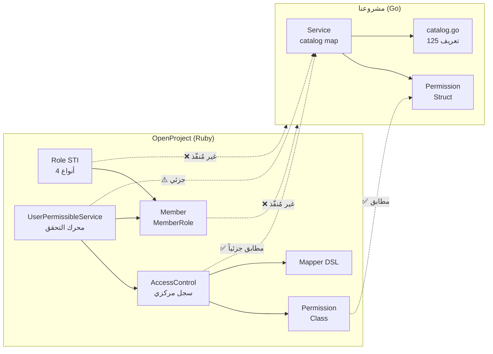

# تحليل مطابقة الصلاحيات: مشروعنا (Go) مقابل OpenProject (Ruby)

> **تاريخ التحليل:** 2026-10-04
> **المصادر:** الكود المصدري لـ OpenProject + مشروعنا `permissions_openproject`

---

## 1. ملخص تنفيذي

| البُعد | OpenProject (Ruby/Rails) | مشروعنا (Go) | نسبة التطابق |
| -------- | -------------------------- | --------------- | ------------- |
| **عدد الصلاحيات المُعرّفة** | ~80 صلاحية (في `permissions.rb`) | 125 صلاحية (في `catalog.go`) | ✅ يتجاوز |
| **سياقات النطاق (Contexts)** | 4 سياقات | 4 سياقات متطابقة | ✅ 100% |
| **التبعيات (Dependencies)** | مدعومة | مدعومة | ✅ 100% |
| **الوحدات (Modules)** | ~10 وحدات | 17 وحدة | ✅ يتجاوز |
| **نظام الأدوار (Roles)** | STI كامل (DB) | ❌ غير مُنفّذ | ⚠️ 0% |
| **العضوية (Membership)** | Member → MemberRole → Role | ❌ غير مُنفّذ | ⚠️ 0% |
| **التحقق من الصلاحيات (Runtime)** | UserPermissibleService | `HasPermission()` بسيط | ⚠️ 20% |
| **Builtin Roles** | 9 أدوار مدمجة | ❌ غير مُنفّذ | ⚠️ 0% |
| **Public Permissions** | مدعومة | ❌ غير مُنفّذة | ⚠️ 0% |
| **Admin Grant** | `grant_to_admin` | ❌ غير مُنفّذ | ⚠️ 0% |
| **Controller Actions Mapping** | مدعوم | ❌ غير مُنفّذ | ⚠️ 0% |
| **Revocation متعدية** | غير موجودة صراحةً | `ResolveRevocation()` ✅ | 🟢 إضافة |
| **Validation سياقية** | ضمنية عبر STI | `ValidatePermissionsForContext()` ✅ | 🟢 إضافة |

---

## 2. تحليل البنية المعمارية

### 2.1 OpenProject — البنية الأصلية (Ruby on Rails)

```
OpenProject::AccessControl          ← السجل المركزي (Singleton)
├── AccessControl::Permission       ← تعريف الصلاحية الواحدة
├── AccessControl::Mapper           ← DSL لتسجيل الصلاحيات
└── config/initializers/permissions.rb  ← تعريفات جميع الصلاحيات

Role (STI Base)                     ← الدور الأساسي (قاعدة بيانات)
├── GlobalRole                      ← أدوار عامة على مستوى المنصة
├── ProjectRole                     ← أدوار على مستوى المشروع
├── WorkPackageRole                 ← أدوار مشاركة حزم العمل
└── ProjectQueryRole                ← أدوار استعلامات المشاريع

Member                              ← ربط المستخدم بالمشروع/الكيان
└── MemberRole                      ← ربط العضو بالأدوار

Authorization::UserPermissibleService  ← محرك التحقق من الصلاحيات
Users::PermissionChecks                ← واجهة التحقق على المستخدم
```

### 2.2 مشروعنا — البنية الحالية (Go)

```
internal/services/permissions/
├── permission.go     ← نموذج Permission + Context + Module + Dependency
├── catalog.go        ← 125 صلاحية مُعرّفة مع ثوابت + تعريفات كاملة
├── service.go        ← Service مع واجهة IPermissionService
└── service_test.go   ← اختبارات شاملة (7 حالات اختبار)

internal/services/roles/   ← فارغ حالياً
```

### 2.3 مخطط المقارنة البنيوية



---

## 3. تحليل تفصيلي لخصائص الصلاحية

### 3.1 نموذج الصلاحية (Permission Model)

| الخاصية | OpenProject `Permission` | مشروعنا `Permission` | الحالة |
| --------- | -------------------------- | ---------------------- | -------- |
| `name` / `ID` | `:symbol` (Ruby Symbol) | `string` | ✅ متوافق |
| `permissible_on` | `[]Symbol` (project, global, work_package, project_query) | `[]Context` (نفس القيم) | ✅ مطابق |
| `project_module` | `Symbol` | `Module` (string) | ✅ متوافق |
| `dependencies` | `[]Symbol` | `[]Dependency` (مع وصف إضافي) | ✅ مُحسّن |
| `controller_actions` | `Hash{controller => actions}` | ❌ غير موجود | ⚠️ ناقص |
| `contract_actions` | `Hash{resource => actions}` | ❌ غير موجود | ⚠️ ناقص |
| `public` | `boolean` — يُمنح لأي عضو | ❌ غير موجود | ⚠️ ناقص |
| `require` | `:member` أو `:loggedin` أو `nil` | ❌ غير موجود | ⚠️ ناقص |
| `visible` | `boolean` أو `Proc` | ❌ غير موجود | ⚠️ ناقص |
| `grant_to_admin` | `boolean` — هل يُمنح للمسؤول تلقائياً | ❌ غير موجود | ⚠️ ناقص |
| `enabled` | `boolean` — يمكن تعطيلها | ❌ غير موجود | ⚠️ ناقص |
| `DisplayName` | عبر I18n | `string` مباشر | ✅ مختلف لكن وظيفي |
| `Description` | عبر I18n | `string` مباشر | ✅ مختلف لكن وظيفي |

### 3.2 السياقات (Contexts) — مطابقة كاملة ✅

| السياق | OpenProject | مشروعنا | ملاحظات |
| -------- | ------------- | --------- | --------- |
| `global` | `permissible_on: :global` | `ContextGlobal` | صلاحيات على مستوى المنصة |
| `project` | `permissible_on: :project` | `ContextProject` | صلاحيات على مستوى المشروع |
| `work_package` | `permissible_on: :work_package` | `ContextWorkPackage` | مشاركة حزم العمل |
| `project_query` | `permissible_on: :project_query` | `ContextProjectQuery` | استعلامات المشاريع المحفوظة |

### 3.3 الوحدات (Modules)

**في OpenProject** (من `permissions.rb`):

- `work_package_tracking`, `news`, `repository`, `forums`, `activity`
- بالإضافة لصلاحيات بدون وحدة محددة (project-level)

**في مشروعنا** (17 وحدة):

- `global`, `project`, `work_packages`, `gantt`, `boards`, `backlogs`, `budgets`,
  `calendars`, `documents`, `forums`, `github`, `gitlab`, `meetings`, `news`,
  `team_planner`, `time_and_costs`, `wiki`, `file_storage`

> ✅ مشروعنا يغطي وحدات أكثر بما يشمل وحدات الإضافات (modules) من plugins خارجية.

---

## 4. تحليل آليات العمل

### 4.1 تسجيل الصلاحيات (Registration)

**OpenProject:**

```ruby
# DSL عبر Mapper
OpenProject::AccessControl.map do |map|
  map.project_module :work_package_tracking do |wpt|
    wpt.permission :view_work_packages,
                   { work_packages: %i[show index] },
                   permissible_on: %i[work_package project],
                   dependencies: :view_project
  end
end
```

**مشروعنا:**

```go
// تعريف مباشر في مصفوفة
var rawPermissionDefinitions = []Permission{
    {
        ID:            PermViewWorkPackages,
        DisplayName:   "View work packages",
        Description:   "Allows viewing work packages.",
        PermissibleOn: []Context{ContextProject, ContextWorkPackage},
        Module:        ModuleWorkPackages,
    },
}
```

| الجانب | OpenProject | مشروعنا |
| -------- | ------------- | --------- |
| أسلوب التسجيل | DSL ديناميكي مع Mapper | مصفوفة ثابتة `rawPermissionDefinitions` |
| قابلية التوسيع | Plugins يمكنها إضافة صلاحيات عبر `AccessControl.map` | يتطلب تعديل `catalog.go` |
| ربط بالـ Controllers | ✅ مباشر عبر Hash | ❌ غير موجود |

### 4.2 نظام الأدوار (Roles) — الفجوة الأكبر ❌

**OpenProject** يستخدم **Single Table Inheritance (STI)**:

```
Role (base)
├── GlobalRole        → صلاحيات global فقط
├── ProjectRole       → صلاحيات project + builtin roles (Anonymous, Non-member)
├── WorkPackageRole   → صلاحيات work_package sharing
└── ProjectQueryRole  → صلاحيات project_query sharing
```

**Builtin Roles** (9 أدوار مدمجة):

| الثابت | القيمة | الوصف |
| -------- | -------- | ------- |
| `NON_BUILTIN` | 0 | دور عادي (قابل للحذف) |
| `BUILTIN_NON_MEMBER` | 1 | غير العضو (ProjectRole) |
| `BUILTIN_ANONYMOUS` | 2 | مجهول (ProjectRole) |
| `BUILTIN_WORK_PACKAGE_VIEWER` | 3 | مشاهد حزم العمل |
| `BUILTIN_WORK_PACKAGE_COMMENTER` | 4 | معلّق على حزم العمل |
| `BUILTIN_WORK_PACKAGE_EDITOR` | 5 | محرر حزم العمل |
| `BUILTIN_PROJECT_QUERY_VIEW` | 6 | مشاهد استعلامات |
| `BUILTIN_PROJECT_QUERY_EDIT` | 7 | محرر استعلامات |
| `BUILTIN_STANDARD_GLOBAL` | 8 | الدور العام القياسي |

**مشروعنا:** لا يوجد أي تمثيل للأدوار حالياً. المجلد `internal/services/roles/` فارغ.

### 4.3 العضوية (Membership) — فجوة ❌

**OpenProject:**

```
User ←→ Member ←→ MemberRole ←→ Role
              ↓
        Project أو Entity (WorkPackage, ProjectQuery)
```

- `Member` يربط `principal` (User/Group) بـ `project` و/أو `entity`
- `MemberRole` يربط العضو بالأدوار (مع دعم الوراثة `inherited_from`)
- يدعم `ALLOWED_ENTITIES = ["WorkPackage", "ProjectQuery"]`

**مشروعنا:** لا يوجد نظام عضوية. الخدمة تتعامل مع قوائم معرّفات صلاحيات مباشرة.

### 4.4 التحقق من الصلاحيات في وقت التشغيل (Runtime Authorization)

**OpenProject** — `UserPermissibleService`:

```ruby
# فحص متعدد المستويات
allowed_globally?(permission)          # هل يملك الصلاحية عالمياً؟
allowed_in_project?(permission, project) # هل يملكها في مشروع معين؟
allowed_in_any_project?(permission)    # هل يملكها في أي مشروع؟
allowed_in_entity?(permission, entity) # هل يملكها على كيان معين؟
allowed_in_any_entity?(permission, class) # هل يملكها على أي كيان؟
```

يشمل:

- ✅ فحص حالة المستخدم (locked/deleted)
- ✅ فحص Admin مع `grant_to_admin`
- ✅ فحص الوحدات المُفعّلة في المشروع
- ✅ تخزين مؤقت (caching) للأداء
- ✅ فحص حالة المشروع (active/archived)

**مشروعنا** — `Service`:

```go
HasPermission(grantedPermissions []string, requiredPermission string) bool
// → فحص بسيط: هل المعرّف موجود في القائمة؟
```

| القدرة | OpenProject | مشروعنا |
| -------- | ------------- | --------- |
| فحص صلاحية بسيط | ✅ | ✅ `HasPermission` |
| فحص سياقي (project/global/entity) | ✅ متقدم | ✅ `ValidatePermissionsForContext` |
| فحص Admin bypass | ✅ | ❌ |
| فحص حالة المستخدم | ✅ | ❌ |
| فحص وحدات المشروع المُفعّلة | ✅ | ❌ |
| Caching | ✅ | ❌ |
| Transitive Revocation | ❌ | ✅ `ResolveRevocation` |

### 4.5 إلغاء الصلاحيات (Revocation)

**OpenProject:** يتم يدوياً عبر `remove_permission!` بدون تتبع تبعيات.

**مشروعنا:** `ResolveRevocation` — إلغاء متعدٍ (transitive) ✅

```go
// عند إلغاء manage_members:
// → يُلغى تلقائياً invite_members_by_email (لأنه يعتمد عليه)
remaining := svc.ResolveRevocation(active, "manage_members")
```

> 🟢 **هذه ميزة إضافية** غير موجودة صراحةً في OpenProject.

---

## 5. مقارنة الصلاحيات المُعرّفة

### 5.1 صلاحيات موجودة في OpenProject وغير موجودة في مشروعنا

| الصلاحية | الوحدة | ملاحظات |
| ---------- | -------- | --------- |
| `view_project` | project | public permission |
| `search_project` | project | public permission |
| `view_news` | news | public permission |
| `view_messages` | forums | public permission |
| `view_project_activity` | activity | public permission |
| `browse_repository` | repository | وحدة المستودعات |
| `commit_access` | repository | وصول الـ commits |
| `manage_repository` | repository | إدارة المستودعات |
| `view_changesets` | repository | مشاهدة التغييرات |
| `view_commit_author_statistics` | repository | إحصائيات المؤلف |
| `add_work_package_comments` | work_packages | (لدينا `add_comments` بدلاً منه) |
| `edit_own_work_package_comments` | work_packages | (لدينا `edit_own_comments`) |
| `edit_work_package_comments` | work_packages | (لدينا `moderate_comments`) |
| `add_work_package_attachments` | work_packages | (لدينا `add_attachments`) |
| `copy_work_packages` | work_packages | (لدينا `duplicate_work_packages`) |
| `manage_categories` | work_packages | (لدينا `manage_work_package_categories`) |
| `manage_subtasks` | work_packages | (لدينا `manage_work_package_hierarchies`) |
| `manage_public_queries` | work_packages | (لدينا `manage_public_views`) |
| `save_queries` | work_packages | (لدينا `save_views`) |
| `view_work_package_watchers` | work_packages | (لدينا `view_watchers_list`) |
| `add_work_package_watchers` | work_packages | (لدينا `add_watchers`) |
| `delete_work_package_watchers` | work_packages | (لدينا `delete_watchers`) |
| `work_package_assigned` | work_packages | (لدينا `become_assignee_responsible`) |
| `view_shared_work_packages` | work_packages | (لدينا `view_work_package_shares`) |
| `manage_types` | project | (لدينا `select_types`) |
| `manage_project_variants` | project | صلاحية جديدة |
| `select_project_custom_fields` | project | (لدينا `select_custom_fields`) |
| `add_messages` | forums | (لدينا `post_messages`) |
| `manage_own_working_times` | global | صلاحية جديدة |
| `manage_working_times` | global | صلاحية جديدة |
| `manage_public_project_queries` | global | (لدينا `manage_public_project_lists`) |
| `view_project_query` | project_query | صلاحية سياق project_query |
| `edit_project_query` | project_query | صلاحية سياق project_query |
| `view_all_principals` | global | (لدينا `view_all_users_and_groups`) |
| `manage_user` | global | (لدينا `edit_users`) |
| `manage_placeholder_user` | global | (لدينا `manage_placeholder_users`) |
| `view_user_email` | global | (لدينا `view_all_users_mail_addresses`) |
| `add_internal_comments` | work_packages | (لدينا `write_internal_comments`) |
| `edit_others_internal_comments` | work_packages | (لدينا `moderate_internal_comments`) |

### 5.2 صلاحيات موجودة في مشروعنا وغير مُعرّفة في `permissions.rb` الأساسي

هذه صلاحيات من **وحدات OpenProject الخارجية** (plugins/modules):

| الصلاحية | الوحدة | المصدر |
| ---------- | -------- | -------- |
| `view_boards` / `manage_boards` | boards | Boards plugin |
| `view_sprints` / `create_sprints` / إلخ | backlogs | Backlogs plugin |
| `view_budgets` / `edit_budgets` | budgets | Budgets plugin |
| `view_calendars` / `edit_calendars` / `subscribe_to_icalendars` | calendars | Calendars plugin |
| `view_documents` / `manage_documents` | documents | Documents plugin |
| `show_github_content` | github | GitHub Integration |
| `show_gitlab_content` | gitlab | GitLab Integration |
| `view_meetings` / `create_meetings` / إلخ | meetings | Meetings plugin |
| `view_team_planner` / `manage_team_planner` | team_planner | Team Planner plugin |
| جميع صلاحيات `time_and_costs` | time_and_costs | Costs plugin |
| جميع صلاحيات `wiki` | wiki | Wiki module |
| جميع صلاحيات `file_storage` | file_storage | Storages plugin |
| `manage_dashboards` | project | ميزة لوحة المعلومات |

> ✅ مشروعنا يشمل صلاحيات OpenProject الأساسية + الإضافات، مما يجعله أشمل.

---

## 6. تحليل اختلاف أسماء الصلاحيات

بعض الصلاحيات موجودة بأسماء مختلفة قليلاً:

| في OpenProject | في مشروعنا | ملاحظات |
| ---------------- | ----------- | --------- |
| `add_work_package_comments` | `add_comments` | تبسيط الاسم |
| `edit_work_package_comments` | `moderate_comments` | تغيير دلالي |
| `copy_work_packages` | `duplicate_work_packages` | تغيير مصطلح |
| `manage_categories` | `manage_work_package_categories` | توضيح أكثر |
| `manage_subtasks` | `manage_work_package_hierarchies` | توضيح أكثر |
| `manage_public_queries` | `manage_public_views` | مصطلح أحدث |
| `save_queries` | `save_views` | مصطلح أحدث |
| `view_work_package_watchers` | `view_watchers_list` | تبسيط |
| `work_package_assigned` | `become_assignee_responsible` | توضيح أكثر |
| `view_all_principals` | `view_all_users_and_groups` | توضيح أكثر |
| `manage_user` | `edit_users` | تضييق النطاق |

---

## 7. الفجوات الرئيسية وخطة الإكمال

### 7.1 فجوات حرجة (يجب معالجتها)

#### ❌ F1: نظام الأدوار (Roles System)

**الأولوية:** عالية جداً

OpenProject يعتمد على STI لأربعة أنواع أدوار. المطلوب:

```go
// internal/services/roles/
type RoleType string
const (
    RoleTypeGlobal       RoleType = "GlobalRole"
    RoleTypeProject      RoleType = "ProjectRole"
    RoleTypeWorkPackage  RoleType = "WorkPackageRole"
    RoleTypeProjectQuery RoleType = "ProjectQueryRole"
)

type Role struct {
    ID          string
    Name        string
    Type        RoleType
    Builtin     int        // 0 = عادي, 1-8 = مدمج
    Permissions []string   // معرّفات الصلاحيات
    Position    int
}
```

#### ❌ F2: نظام العضوية (Membership)

**الأولوية:** عالية

```go
type Member struct {
    UserID     string
    ProjectID  string     // اختياري
    EntityType string     // "WorkPackage" أو "ProjectQuery"
    EntityID   string     // اختياري
    Roles      []Role
}
```

#### ❌ F3: خصائص الصلاحية المفقودة

**الأولوية:** متوسطة

يجب إضافة الحقول التالية لـ `Permission`:

```go
type Permission struct {
    // ... الحقول الحالية ...
    Public       bool   // صلاحية عامة (مثل view_project)
    Require      string // "member" أو "loggedin" أو ""
    GrantToAdmin bool   // هل تُمنح للمسؤول تلقائياً
    Enabled      bool   // هل الصلاحية مُفعّلة
    Visible      bool   // هل تظهر في الواجهة
}
```

### 7.2 فجوات ثانوية (يُفضّل معالجتها)

| الفجوة | الوصف | الأولوية |
| -------- | ------- | ---------- |
| F4: Controller Actions | ربط الصلاحيات بمسارات API/HTTP | منخفضة (Go محايد) |
| F5: Contract Actions | ربط الصلاحيات بعمليات العقود | منخفضة |
| F6: Module Enable/Disable | تفعيل/تعطيل وحدات المشروع | متوسطة |
| F7: Permission Caching | تخزين مؤقت لنتائج التحقق | متوسطة |
| F8: Group Inheritance | وراثة الأدوار من المجموعات | منخفضة |

### 7.3 ميزات مشروعنا الإضافية 🟢

| الميزة | الوصف | حالة OpenProject |
| -------- | ------- | ------------------ |
| `ResolveRevocation` | إلغاء متعدٍ للصلاحيات مع التبعيات | غير موجودة صراحةً |
| `ValidatePermissionsForContext` | تصفية صلاحيات حسب السياق المستهدف | ضمنية عبر STI |
| `Dependency.Description` | وصف نصي لكل تبعية | غير موجود |
| ثوابت مُسمّاة | `PermViewWorkPackages` بدل `:view_work_packages` | Ruby Symbols فقط |
| 125 صلاحية شاملة | تشمل الإضافات الخارجية | موزعة على عدة ملفات |

---

## 8. الخلاصة والتوصيات

### نقاط القوة في مشروعنا

1. ✅ **كتالوج شامل** — 125 صلاحية تغطي OpenProject + جميع إضافاته
2. ✅ **4 سياقات متطابقة** مع OpenProject
3. ✅ **نظام تبعيات** مع وصف + إلغاء متعدٍ
4. ✅ **اختبارات شاملة** (7 حالات اختبار تغطي جميع الآليات)
5. ✅ **تصنيف بالوحدات** أشمل من OpenProject الأساسي

### نقاط الضعف

1. ❌ **غياب نظام الأدوار** — الفجوة الأكبر
2. ❌ **غياب نظام العضوية** — لا ربط بين المستخدمين والصلاحيات
3. ⚠️ **التحقق من الصلاحيات بسيط** — يحتاج محرك متقدم مثل `UserPermissibleService`
4. ⚠️ **خصائص ناقصة** — `public`, `require`, `grant_to_admin`

### الأولوية المقترحة

1. 🔴 تنفيذ نظام الأدوار (`internal/services/roles/`)
2. 🔴 إضافة الخصائص المفقودة لنموذج `Permission`
3. 🟡 تنفيذ نظام العضوية
4. 🟡 تطوير محرك التحقق من الصلاحيات
5. 🟢 إضافة Caching وتحسين الأداء
